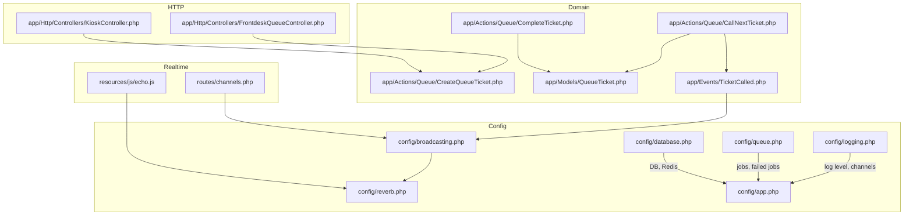
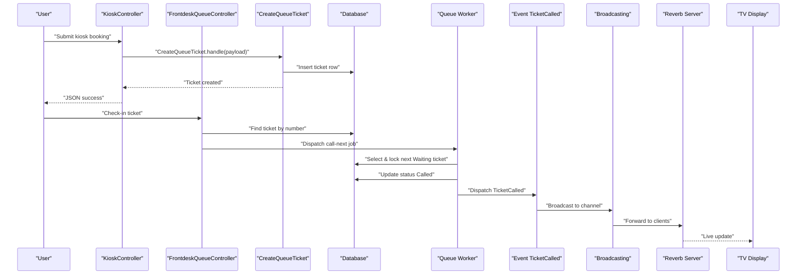
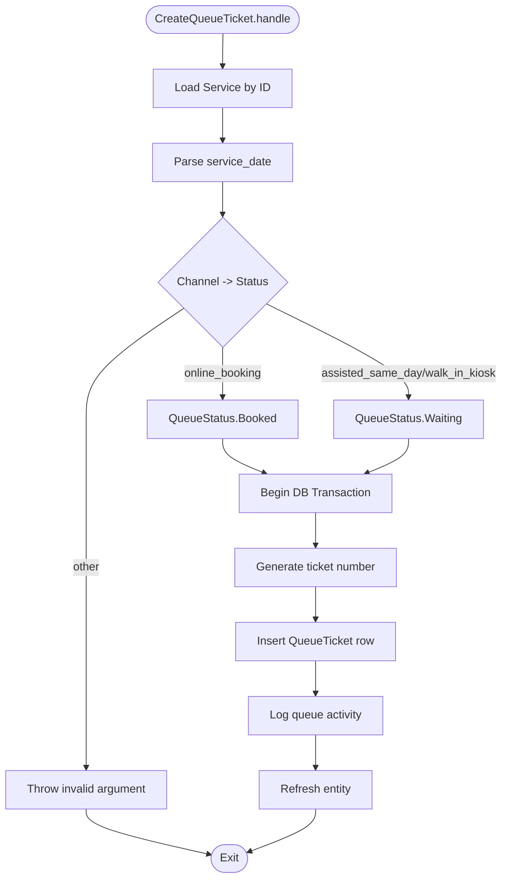
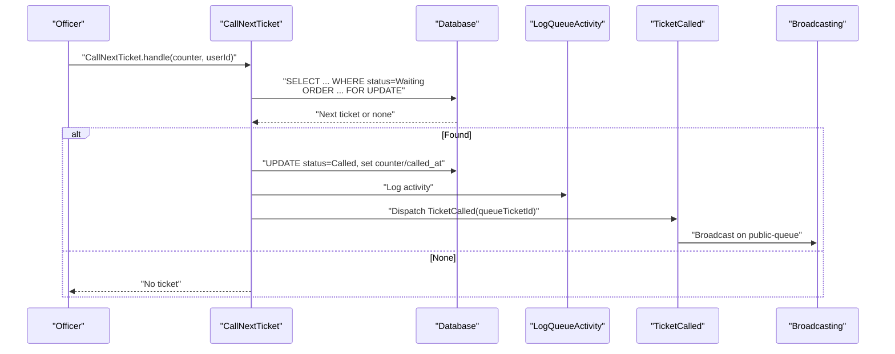
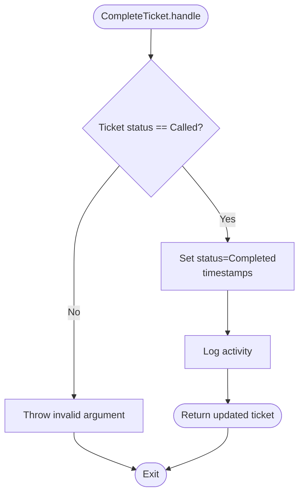
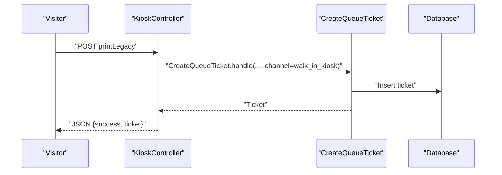
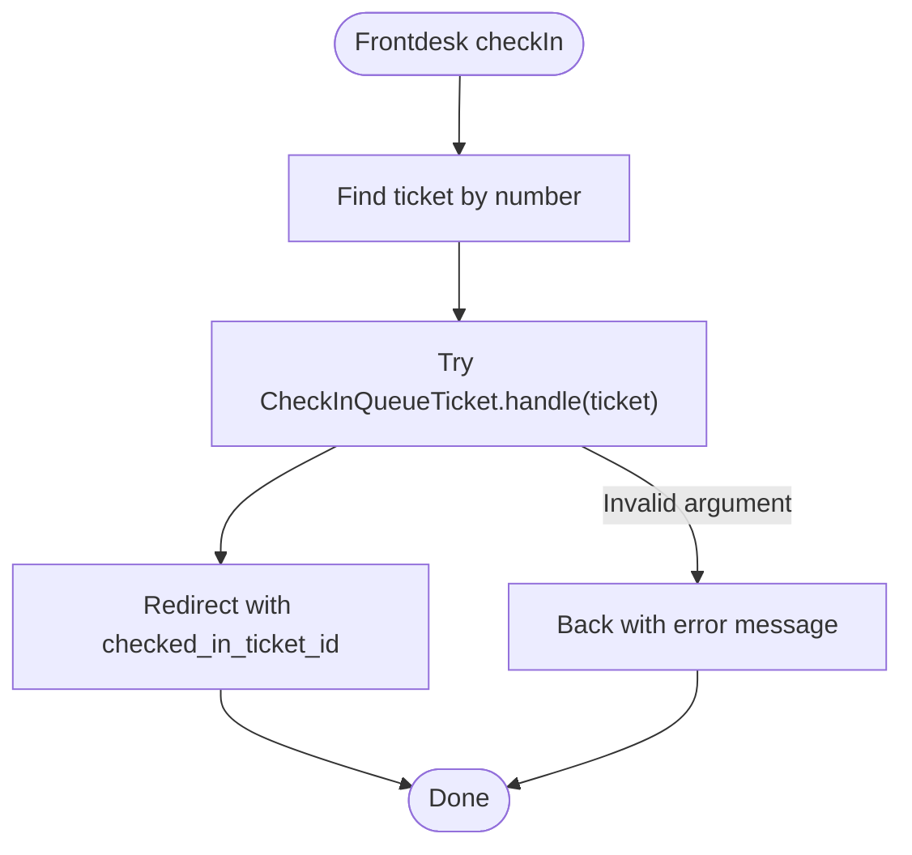
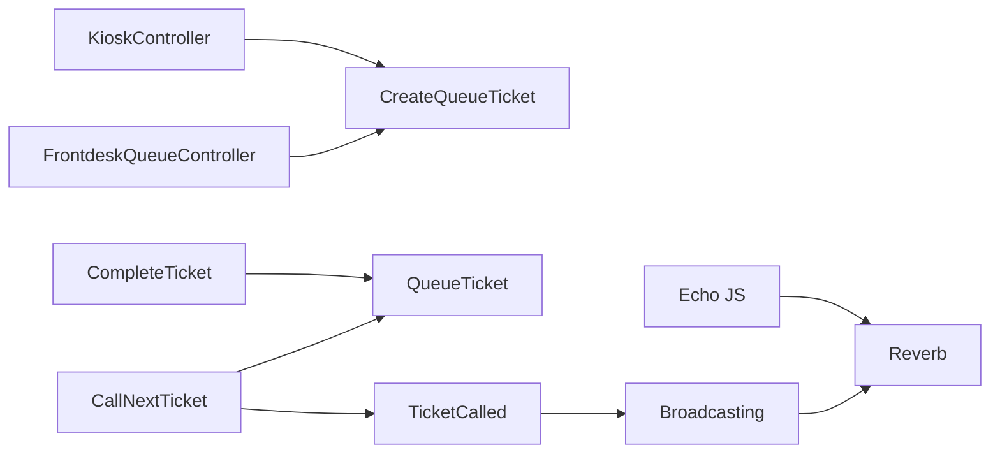

# Troubleshooting and FAQ

<cite>
**Referenced Files in This Document**
- [logging.php](file://config/logging.php)
- [queue.php](file://config/queue.php)
- [broadcasting.php](file://config/broadcasting.php)
- [reverb.php](file://config/reverb.php)
- [app.php](file://config/app.php)
- [database.php](file://config/database.php)
- [CreateQueueTicket.php](file://app/Actions/Queue/CreateQueueTicket.php)
- [CallNextTicket.php](file://app/Actions/Queue/CallNextTicket.php)
- [CompleteTicket.php](file://app/Actions/Queue/CompleteTicket.php)
- [FrontdeskQueueController.php](file://app/Http/Controllers/FrontdeskQueueController.php)
- [KioskController.php](file://app/Http/Controllers/KioskController.php)
- [TicketCalled.php](file://app/Events/TicketCalled.php)
- [QueueTicket.php](file://app/Models/QueueTicket.php)
- [channels.php](file://routes/channels.php)
- [echo.js](file://resources/js/echo.js)
</cite>

## Table of Contents
1. [Introduction](#introduction)
2. [Project Structure](#project-structure)
3. [Core Components](#core-components)
4. [Architecture Overview](#architecture-overview)
5. [Detailed Component Analysis](#detailed-component-analysis)
6. [Dependency Analysis](#dependency-analysis)
7. [Performance Considerations](#performance-considerations)
8. [Troubleshooting Guide](#troubleshooting-guide)
9. [Conclusion](#conclusion)
10. [Appendices](#appendices)

## Introduction
This document provides comprehensive troubleshooting guidance for the PTSP queue management system. It covers installation and configuration pitfalls, runtime diagnostics for queues and real-time updates, integration checks for external services, and operational FAQs. It leverages Laravel’s logging, broadcasting, and queue subsystems to help you diagnose and resolve issues quickly.

## Project Structure
The PTSP system is a Laravel application with modular queue operations, broadcasting for live TV displays, and configurable logging and queue backends. Key areas affecting reliability and operability include:
- Logging configuration for local and remote sinks
- Queue backends for asynchronous work
- Broadcasting configuration for real-time updates
- Database connectivity and Redis tuning
- Controller actions and domain actions orchestrating queue state transitions

**Diagram sources**
- [logging.php:1-133](file://config/logging.php#L1-L133)
- [queue.php:1-130](file://config/queue.php#L1-L130)
- [broadcasting.php:1-83](file://config/broadcasting.php#L1-L83)
- [reverb.php:1-103](file://config/reverb.php#L1-L103)
- [app.php:1-127](file://config/app.php#L1-L127)
- [database.php:1-185](file://config/database.php#L1-L185)
- [CreateQueueTicket.php:1-91](file://app/Actions/Queue/CreateQueueTicket.php#L1-L91)
- [CallNextTicket.php:1-80](file://app/Actions/Queue/CallNextTicket.php#L1-L80)
- [CompleteTicket.php:1-49](file://app/Actions/Queue/CompleteTicket.php#L1-L49)
- [QueueTicket.php:1-121](file://app/Models/QueueTicket.php#L1-L121)
- [TicketCalled.php:1-34](file://app/Events/TicketCalled.php#L1-L34)
- [FrontdeskQueueController.php:1-89](file://app/Http/Controllers/FrontdeskQueueController.php#L1-L89)
- [KioskController.php:1-144](file://app/Http/Controllers/KioskController.php#L1-L144)
- [channels.php:1-8](file://routes/channels.php#L1-L8)
- [echo.js:1-15](file://resources/js/echo.js#L1-L15)

**Section sources**
- [logging.php:1-133](file://config/logging.php#L1-L133)
- [queue.php:1-130](file://config/queue.php#L1-L130)
- [broadcasting.php:1-83](file://config/broadcasting.php#L1-L83)
- [reverb.php:1-103](file://config/reverb.php#L1-L103)
- [app.php:1-127](file://config/app.php#L1-L127)
- [database.php:1-185](file://config/database.php#L1-L185)

## Core Components
- Logging: Centralized configuration for local files, daily rotation, Slack, syslog, stderr, and Papertrail. Use appropriate channels and levels for environments.
- Queue: Configurable backends (sync, database, beanstalkd, SQS, redis, failover). Failed jobs are persisted for later inspection.
- Broadcasting: Supports Reverb, Pusher, Ably, log, and null. Real-time updates are broadcast to clients.
- Domain Actions: Encapsulate queue operations (create, call, complete) with transactional safety and activity logging.
- Controllers: Orchestrate user-facing flows (frontdesk and kiosk) and delegate to actions.
- Models and Events: Represent queue state and emit real-time events.

**Section sources**
- [logging.php:53-130](file://config/logging.php#L53-L130)
- [queue.php:16-127](file://config/queue.php#L16-L127)
- [broadcasting.php:18-80](file://config/broadcasting.php#L18-L80)
- [CreateQueueTicket.php:34-89](file://app/Actions/Queue/CreateQueueTicket.php#L34-L89)
- [CallNextTicket.php:19-78](file://app/Actions/Queue/CallNextTicket.php#L19-L78)
- [CompleteTicket.php:17-47](file://app/Actions/Queue/CompleteTicket.php#L17-L47)
- [FrontdeskQueueController.php:44-87](file://app/Http/Controllers/FrontdeskQueueController.php#L44-L87)
- [KioskController.php:114-142](file://app/Http/Controllers/KioskController.php#L114-L142)

## Architecture Overview
The system integrates HTTP requests, domain actions, database persistence, queue workers, and real-time broadcasting.

**Diagram sources**
- [KioskController.php:114-142](file://app/Http/Controllers/KioskController.php#L114-L142)
- [FrontdeskQueueController.php:66-87](file://app/Http/Controllers/FrontdeskQueueController.php#L66-L87)
- [CreateQueueTicket.php:34-89](file://app/Actions/Queue/CreateQueueTicket.php#L34-L89)
- [CallNextTicket.php:19-78](file://app/Actions/Queue/CallNextTicket.php#L19-L78)
- [TicketCalled.php:18-32](file://app/Events/TicketCalled.php#L18-L32)
- [broadcasting.php:33-47](file://config/broadcasting.php#L33-L47)
- [reverb.php:29-55](file://config/reverb.php#L29-L55)

## Detailed Component Analysis

### Queue Creation Workflow
- Validates payload and selects service and date.
- Determines initial status based on channel.
- Creates ticket inside a transaction and logs activity.

**Diagram sources**
- [CreateQueueTicket.php:34-89](file://app/Actions/Queue/CreateQueueTicket.php#L34-L89)

**Section sources**
- [CreateQueueTicket.php:34-89](file://app/Actions/Queue/CreateQueueTicket.php#L34-L89)

### Call Next Ticket Workflow
- Selects the next eligible Waiting ticket in the counter’s queue pool.
- Applies officer-scoped filtering if applicable.
- Locks the row, updates status, logs activity, and emits a broadcast event.

**Diagram sources**
- [CallNextTicket.php:19-78](file://app/Actions/Queue/CallNextTicket.php#L19-L78)
- [TicketCalled.php:18-32](file://app/Events/TicketCalled.php#L18-L32)
- [broadcasting.php:33-47](file://config/broadcasting.php#L33-L47)

**Section sources**
- [CallNextTicket.php:19-78](file://app/Actions/Queue/CallNextTicket.php#L19-L78)
- [TicketCalled.php:18-32](file://app/Events/TicketCalled.php#L18-L32)

### Complete Ticket Workflow
- Validates that the ticket is Called before marking Completed.
- Records timestamps and logs activity.

**Diagram sources**
- [CompleteTicket.php:17-47](file://app/Actions/Queue/CompleteTicket.php#L17-L47)

**Section sources**
- [CompleteTicket.php:17-47](file://app/Actions/Queue/CompleteTicket.php#L17-L47)

### Kiosk Booking Flow
- Validates required fields and creates a walk-in kiosk ticket.
- Returns JSON with success and ticket data.

**Diagram sources**
- [KioskController.php:114-142](file://app/Http/Controllers/KioskController.php#L114-L142)
- [CreateQueueTicket.php:34-89](file://app/Actions/Queue/CreateQueueTicket.php#L34-L89)

**Section sources**
- [KioskController.php:114-142](file://app/Http/Controllers/KioskController.php#L114-L142)

### Frontdesk Check-in Flow
- Finds ticket by number and attempts check-in.
- Handles invalid argument exceptions for non-eligible tickets.

**Diagram sources**
- [FrontdeskQueueController.php:66-87](file://app/Http/Controllers/FrontdeskQueueController.php#L66-L87)

**Section sources**
- [FrontdeskQueueController.php:66-87](file://app/Http/Controllers/FrontdeskQueueController.php#L66-L87)

## Dependency Analysis
- Controllers depend on domain actions for business logic.
- Domain actions depend on models and database transactions.
- Broadcasting depends on Reverb/Pusher configuration and JS client setup.
- Queue worker depends on configured backend and failed job storage.

**Diagram sources**
- [FrontdeskQueueController.php:44-87](file://app/Http/Controllers/FrontdeskQueueController.php#L44-L87)
- [KioskController.php:114-142](file://app/Http/Controllers/KioskController.php#L114-L142)
- [CreateQueueTicket.php:34-89](file://app/Actions/Queue/CreateQueueTicket.php#L34-L89)
- [CallNextTicket.php:19-78](file://app/Actions/Queue/CallNextTicket.php#L19-L78)
- [CompleteTicket.php:17-47](file://app/Actions/Queue/CompleteTicket.php#L17-L47)
- [TicketCalled.php:18-32](file://app/Events/TicketCalled.php#L18-L32)
- [broadcasting.php:33-47](file://config/broadcasting.php#L33-L47)
- [reverb.php:29-55](file://config/reverb.php#L29-L55)
- [echo.js:6-14](file://resources/js/echo.js#L6-L14)

**Section sources**
- [FrontdeskQueueController.php:44-87](file://app/Http/Controllers/FrontdeskQueueController.php#L44-L87)
- [KioskController.php:114-142](file://app/Http/Controllers/KioskController.php#L114-L142)
- [CreateQueueTicket.php:34-89](file://app/Actions/Queue/CreateQueueTicket.php#L34-L89)
- [CallNextTicket.php:19-78](file://app/Actions/Queue/CallNextTicket.php#L19-L78)
- [CompleteTicket.php:17-47](file://app/Actions/Queue/CompleteTicket.php#L17-L47)
- [TicketCalled.php:18-32](file://app/Events/TicketCalled.php#L18-L32)
- [broadcasting.php:33-47](file://config/broadcasting.php#L33-L47)
- [reverb.php:29-55](file://config/reverb.php#L29-L55)
- [echo.js:6-14](file://resources/js/echo.js#L6-L14)

## Performance Considerations
- Database contention: CallNextTicket uses row-level locking; ensure indexes on queue_pool_id, status, service_date, sequence_number, and id to minimize lock waits.
- Queue throughput: Prefer Redis or SQS for high load; tune retry_after and max retry settings.
- Broadcasting: Ensure Reverb server scaling and Redis-backed clustering are configured for production.
- Logging: Use daily rotation and appropriate levels to avoid disk pressure.

[No sources needed since this section provides general guidance]

## Troubleshooting Guide

### Installation and Setup
- Verify environment variables for logging, queue, broadcasting, and database are present and correct.
- Confirm APP_KEY is generated and deployed.
- Ensure database migrations and seeds are applied.

Diagnostic steps:
- Check default log channel and level.
- Confirm queue connection defaults and failed job driver.
- Validate broadcasting default and Reverb/Pusher keys.

Resolution strategies:
- Regenerate APP_KEY if missing.
- Run migrations and seeds.
- Adjust LOG_LEVEL and LOG_CHANNEL per environment.

**Section sources**
- [app.php:16-124](file://config/app.php#L16-L124)
- [logging.php:21-130](file://config/logging.php#L21-L130)
- [queue.php:16-127](file://config/queue.php#L16-L127)
- [broadcasting.php:18-80](file://config/broadcasting.php#L18-L80)
- [database.php:20-182](file://config/database.php#L20-L182)

### Configuration Errors
Common symptoms:
- Logs not written to expected location.
- Queue jobs not processed.
- Real-time updates not received.

Checklist:
- Logging: Confirm stack channels and file paths.
- Queue: Verify default connection and failed job driver.
- Broadcasting: Ensure default matches Reverb/Pusher and keys are set.
- Database: Confirm selected driver and credentials.

Resolution:
- Align LOG_CHANNEL with stack members.
- Set QUEUE_CONNECTION to a supported backend.
- Configure REVERB_* and broadcaster keys.
- Test DB connectivity and Redis cluster.

**Section sources**
- [logging.php:53-130](file://config/logging.php#L53-L130)
- [queue.php:16-127](file://config/queue.php#L16-L127)
- [broadcasting.php:18-80](file://config/broadcasting.php#L18-L80)
- [database.php:33-182](file://config/database.php#L33-L182)
- [reverb.php:29-100](file://config/reverb.php#L29-L100)

### Performance Bottlenecks
Symptoms:
- Slow ticket creation or call-next operations.
- Long queue processing times.
- Real-time latency spikes.

Checks:
- Database: Review slow query logs and missing indexes.
- Queue: Inspect failed_jobs and retry_after settings.
- Broadcasting: Monitor Reverb server metrics and client counts.

Optimizations:
- Add composite indexes for queue selection filters.
- Scale queue workers horizontally.
- Tune Redis and Reverb scaling options.

**Section sources**
- [CallNextTicket.php:22-46](file://app/Actions/Queue/CallNextTicket.php#L22-L46)
- [queue.php:43-74](file://config/queue.php#L43-L74)
- [reverb.php:40-55](file://config/reverb.php#L40-L55)

### Integration Failures
Symptoms:
- Kiosk booking returns errors.
- Frontdesk check-in fails with validation errors.
- Real-time TV display does not update.

Checks:
- KioskController validation rules and CreateQueueTicket channel mapping.
- FrontdeskQueueController error handling for invalid arguments.
- Broadcasting channel and Reverb server reachability.

Resolutions:
- Fix validation mismatches and ensure channel is supported.
- Ensure tickets are in the correct status for check-in.
- Verify VITE_REVERB_* environment variables and Reverb server health.

**Section sources**
- [KioskController.php:114-142](file://app/Http/Controllers/KioskController.php#L114-L142)
- [FrontdeskQueueController.php:66-87](file://app/Http/Controllers/FrontdeskQueueController.php#L66-L87)
- [CreateQueueTicket.php:42-46](file://app/Actions/Queue/CreateQueueTicket.php#L42-L46)
- [TicketCalled.php:27-32](file://app/Events/TicketCalled.php#L27-L32)
- [echo.js:6-14](file://resources/js/echo.js#L6-L14)

### Queue System Diagnostics
Common issues:
- Jobs stuck in pending.
- Duplicate or missing failed jobs.
- Worker process crashes.

Procedures:
- Inspect failed_jobs table for records and reasons.
- Tail queue worker logs and adjust retry_after.
- Use queue:work with --sleep and --max-jobs for controlled runs.

**Section sources**
- [queue.php:123-127](file://config/queue.php#L123-L127)

### Real-Time Communication Problems
Symptoms:
- No live updates on TV display.
- Echo client cannot connect.

Checks:
- Broadcasting default and Reverb app keys.
- routes/channels.php for authorized channels.
- resources/js/echo.js environment variables.

Resolutions:
- Ensure broadcaster matches Reverb and keys are set.
- Verify VITE_REVERB_* variables and TLS settings.
- Confirm Reverb server is reachable and scaling is configured.

**Section sources**
- [broadcasting.php:18-80](file://config/broadcasting.php#L18-L80)
- [channels.php:5-7](file://routes/channels.php#L5-L7)
- [echo.js:6-14](file://resources/js/echo.js#L6-L14)
- [reverb.php:29-100](file://config/reverb.php#L29-L100)

### External Service Integration Failures
Notes:
- The system integrates with Reverb for broadcasting and optionally with external services via TTS. Ensure service-specific credentials and endpoints are configured.

[No sources needed since this section provides general guidance]

### Error Codes and Log Analysis Techniques
- Use Laravel logs under storage/logs for stack traces and contextual messages.
- Adjust LOG_LEVEL to capture more detail during incidents.
- For broadcasting, correlate Reverb server logs with client-side Echo logs.

Resolution strategies:
- Filter logs by request IDs and timestamps.
- Correlate failed_jobs entries with queue worker logs.
- Validate broadcasting logs for connection drops or rate limiting.

**Section sources**
- [logging.php:21-130](file://config/logging.php#L21-L130)
- [queue.php:123-127](file://config/queue.php#L123-L127)
- [reverb.php:40-55](file://config/reverb.php#L40-L55)

### Frequently Asked Questions

Q: Why is my ticket not appearing on the TV display?
- Ensure the ticket was successfully created and the call-next operation updated status to Called.
- Verify Reverb server is running and broadcasting is enabled.
- Confirm the TV display client connects with correct VITE_REVERB_* variables.

Q: How do I fix “invalid argument” errors when checking in a ticket?
- Check-in is only allowed for tickets in the correct status. Ensure the ticket exists and meets eligibility criteria.

Q: Why are queue jobs not being processed?
- Confirm the queue worker is running and the chosen backend is reachable.
- Review failed_jobs for recurring failures and adjust retry settings.

Q: How do I increase logging verbosity for debugging?
- Set LOG_LEVEL to a lower threshold and ensure the stack includes the desired channels.

Q: What should I check if real-time updates are delayed?
- Validate Reverb server scaling and Redis configuration.
- Check client-side Echo connection and TLS settings.

**Section sources**
- [FrontdeskQueueController.php:75-81](file://app/Http/Controllers/FrontdeskQueueController.php#L75-L81)
- [queue.php:16-127](file://config/queue.php#L16-L127)
- [logging.php:53-130](file://config/logging.php#L53-L130)
- [reverb.php:40-55](file://config/reverb.php#L40-L55)
- [echo.js:6-14](file://resources/js/echo.js#L6-L14)

### Escalation Procedures and Support Contact
- Capture logs from storage/logs and failed_jobs entries.
- Document reproduction steps, environment variables, and timestamps.
- Open a support ticket with the following information:
  - Environment details (APP_ENV, LOG_LEVEL)
  - Queue backend and configuration
  - Broadcasting configuration and Reverb server status
  - Database and Redis settings
  - Screenshots or recordings of the issue

[No sources needed since this section summarizes without analyzing specific files]

## Conclusion
By aligning configuration, monitoring logs and queue states, and validating real-time connectivity, most PTSP issues can be diagnosed and resolved efficiently. Use the provided workflows and checks to isolate problems quickly and escalate with actionable evidence.

[No sources needed since this section summarizes without analyzing specific files]

## Appendices

### Quick Checklist
- APP_KEY present and valid
- Database and Redis connectivity verified
- LOG_CHANNEL and LOG_LEVEL appropriate
- QUEUE_CONNECTION and failed job driver set
- Broadcasting default and keys configured
- Reverb server reachable and scaled
- Echo client environment variables set
- Indexes optimized for queue queries

[No sources needed since this section provides general guidance]