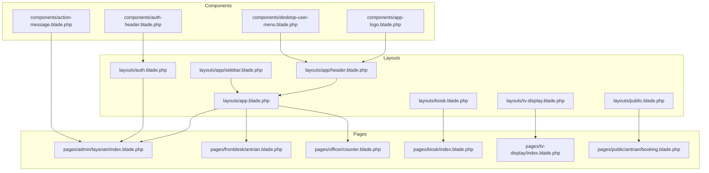
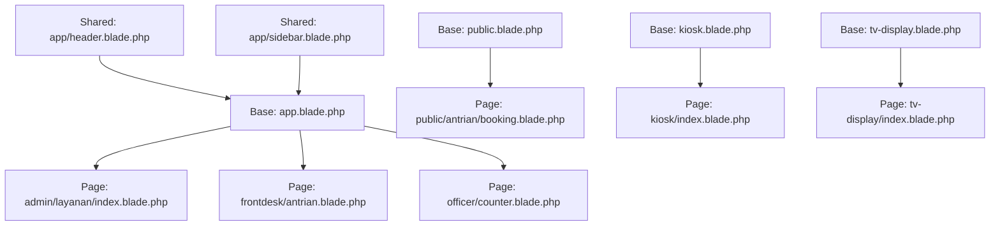
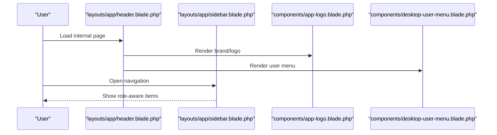
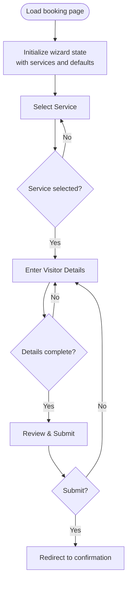
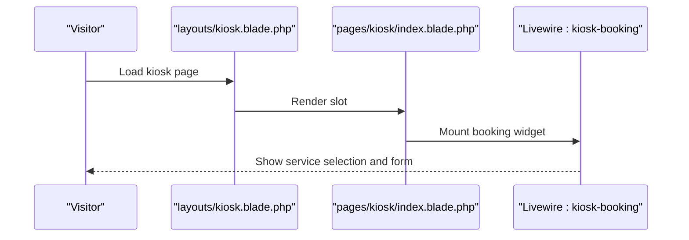
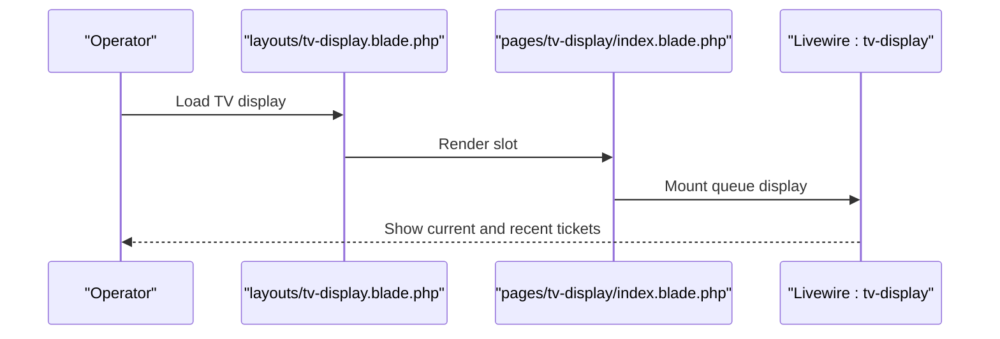
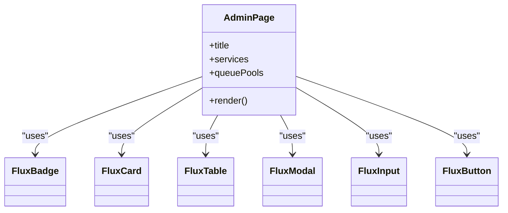
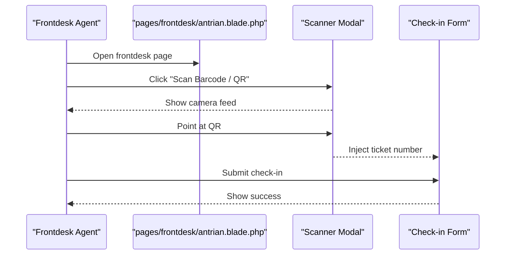
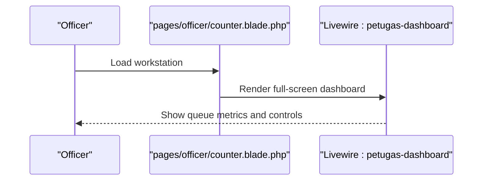
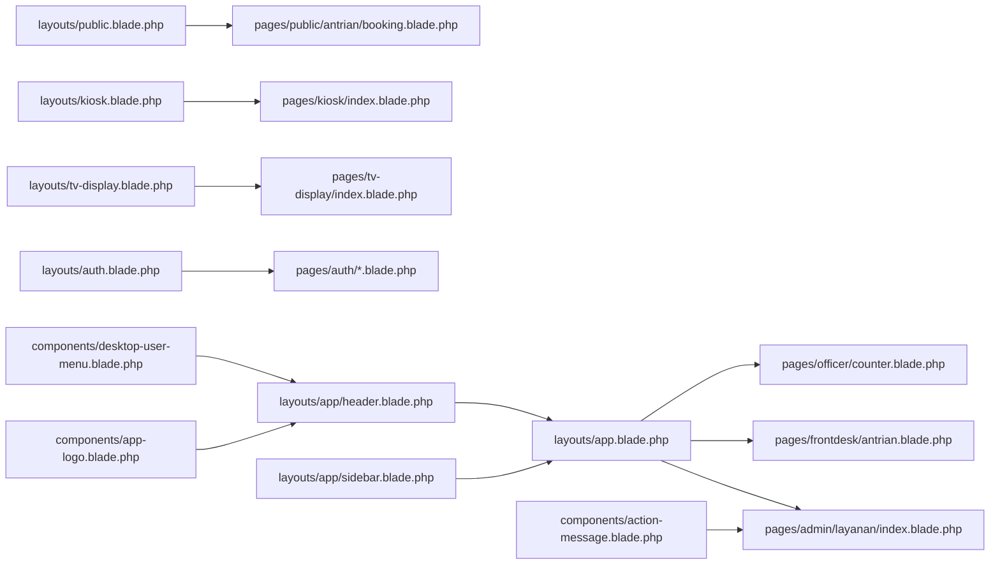

# Blade Templates and Views

<cite>
**Referenced Files in This Document**
- [layouts/app.blade.php](file://resources/views/layouts/app.blade.php)
- [layouts/auth.blade.php](file://resources/views/layouts/auth.blade.php)
- [layouts/kiosk.blade.php](file://resources/views/layouts/kiosk.blade.php)
- [layouts/public.blade.php](file://resources/views/layouts/public.blade.php)
- [layouts/tv-display.blade.php](file://resources/views/layouts/tv-display.blade.php)
- [layouts/app/header.blade.php](file://resources/views/layouts/app/header.blade.php)
- [layouts/app/sidebar.blade.php](file://resources/views/layouts/app/sidebar.blade.php)
- [components/action-message.blade.php](file://resources/views/components/action-message.blade.php)
- [components/app-logo.blade.php](file://resources/views/components/app-logo.blade.php)
- [components/auth-header.blade.php](file://resources/views/components/auth-header.blade.php)
- [components/desktop-user-menu.blade.php](file://resources/views/components/desktop-user-menu.blade.php)
- [pages/admin/layanan/index.blade.php](file://resources/views/pages/admin/layanan/index.blade.php)
- [pages/frontdesk/antrian.blade.php](file://resources/views/pages/frontdesk/antrian.blade.php)
- [pages/officer/counter.blade.php](file://resources/views/pages/officer/counter.blade.php)
- [pages/kiosk/index.blade.php](file://resources/views/pages/kiosk/index.blade.php)
- [pages/tv-display/index.blade.php](file://resources/views/pages/tv-display/index.blade.php)
- [pages/public/antrian/booking.blade.php](file://resources/views/pages/public/antrian/booking.blade.php)
</cite>

## Table of Contents
1. [Introduction](#introduction)
2. [Project Structure](#project-structure)
3. [Core Components](#core-components)
4. [Architecture Overview](#architecture-overview)
5. [Detailed Component Analysis](#detailed-component-analysis)
6. [Dependency Analysis](#dependency-analysis)
7. [Performance Considerations](#performance-considerations)
8. [Troubleshooting Guide](#troubleshooting-guide)
9. [Conclusion](#conclusion)
10. [Appendices](#appendices)

## Introduction
This document explains the Blade template system powering the PTSP interface. It covers page-level templates for public booking, kiosks, TV displays, administrative dashboards, frontdesk operations, and officer counters. It also documents the layout system with shared header, sidebar, and footer components, reusable Blade components for forms, buttons, notifications, and data displays, and demonstrates template inheritance, component composition, and conditional rendering. Styling integration with TailwindCSS and responsive design patterns are addressed, along with accessibility, internationalization, and cross-browser compatibility considerations.

## Project Structure
The Blade templates are organized under resources/views with dedicated directories:
- layouts: page-level base templates for different contexts (app, auth, public, kiosk, tv-display)
- components: reusable UI components (action messages, logos, menus, etc.)
- pages: role-specific page templates (admin, frontdesk, officer, kiosk, tv-display, public)
- partials: shared partials (e.g., head)

**Diagram sources**
- [layouts/public.blade.php:1-152](file://resources/views/layouts/public.blade.php#L1-L152)
- [layouts/kiosk.blade.php:1-67](file://resources/views/layouts/kiosk.blade.php#L1-L67)
- [layouts/tv-display.blade.php:1-31](file://resources/views/layouts/tv-display.blade.php#L1-L31)
- [layouts/app.blade.php:1-6](file://resources/views/layouts/app.blade.php#L1-L6)
- [layouts/app/header.blade.php:1-142](file://resources/views/layouts/app/header.blade.php#L1-L142)
- [layouts/app/sidebar.blade.php:1-242](file://resources/views/layouts/app/sidebar.blade.php#L1-L242)
- [components/action-message.blade.php:1-15](file://resources/views/components/action-message.blade.php#L1-L15)
- [components/app-logo.blade.php:1-18](file://resources/views/components/app-logo.blade.php#L1-L18)
- [components/desktop-user-menu.blade.php:1-40](file://resources/views/components/desktop-user-menu.blade.php#L1-L40)
- [pages/admin/layanan/index.blade.php:1-303](file://resources/views/pages/admin/layanan/index.blade.php#L1-L303)
- [pages/frontdesk/antrian.blade.php:1-426](file://resources/views/pages/frontdesk/antrian.blade.php#L1-L426)
- [pages/officer/counter.blade.php:1-33](file://resources/views/pages/officer/counter.blade.php#L1-L33)
- [pages/kiosk/index.blade.php:1-4](file://resources/views/pages/kiosk/index.blade.php#L1-L4)
- [pages/tv-display/index.blade.php:1-18](file://resources/views/pages/tv-display/index.blade.php#L1-L18)
- [pages/public/antrian/booking.blade.php:1-541](file://resources/views/pages/public/antrian/booking.blade.php#L1-L541)

**Section sources**
- [layouts/app.blade.php:1-6](file://resources/views/layouts/app.blade.php#L1-L6)
- [layouts/auth.blade.php:1-4](file://resources/views/layouts/auth.blade.php#L1-L4)
- [layouts/public.blade.php:1-152](file://resources/views/layouts/public.blade.php#L1-L152)
- [layouts/kiosk.blade.php:1-67](file://resources/views/layouts/kiosk.blade.php#L1-L67)
- [layouts/tv-display.blade.php:1-31](file://resources/views/layouts/tv-display.blade.php#L1-L31)
- [layouts/app/header.blade.php:1-142](file://resources/views/layouts/app/header.blade.php#L1-L142)
- [layouts/app/sidebar.blade.php:1-242](file://resources/views/layouts/app/sidebar.blade.php#L1-L242)

## Core Components
Reusable Blade components encapsulate common UI elements and behaviors:
- Action message: A transient notification bound to Livewire events with Alpine-driven visibility and timing.
- App logo: A Flux brand component with optional sidebar mode.
- Auth header: A centered heading and subheading for authentication pages.
- Desktop user menu: A dropdown menu with profile avatar, navigation items, and logout form.

These components are composed inside layouts and pages to maintain consistency and reduce duplication.

**Section sources**
- [components/action-message.blade.php:1-15](file://resources/views/components/action-message.blade.php#L1-L15)
- [components/app-logo.blade.php:1-18](file://resources/views/components/app-logo.blade.php#L1-L18)
- [components/auth-header.blade.php:1-10](file://resources/views/components/auth-header.blade.php#L1-L10)
- [components/desktop-user-menu.blade.php:1-40](file://resources/views/components/desktop-user-menu.blade.php#L1-L40)

## Architecture Overview
The template architecture follows a layered pattern:
- Base layouts define global HTML shells, meta tags, fonts, and styling hooks.
- Shared header and sidebar provide navigation and branding across internal pages.
- Page templates inherit from base layouts and compose components for specific roles.

**Diagram sources**
- [layouts/public.blade.php:1-152](file://resources/views/layouts/public.blade.php#L1-L152)
- [layouts/kiosk.blade.php:1-67](file://resources/views/layouts/kiosk.blade.php#L1-L67)
- [layouts/tv-display.blade.php:1-31](file://resources/views/layouts/tv-display.blade.php#L1-L31)
- [layouts/app.blade.php:1-6](file://resources/views/layouts/app.blade.php#L1-L6)
- [layouts/app/header.blade.php:1-142](file://resources/views/layouts/app/header.blade.php#L1-L142)
- [layouts/app/sidebar.blade.php:1-242](file://resources/views/layouts/app/sidebar.blade.php#L1-L242)
- [pages/public/antrian/booking.blade.php:1-541](file://resources/views/pages/public/antrian/booking.blade.php#L1-L541)
- [pages/admin/layanan/index.blade.php:1-303](file://resources/views/pages/admin/layanan/index.blade.php#L1-L303)
- [pages/frontdesk/antrian.blade.php:1-426](file://resources/views/pages/frontdesk/antrian.blade.php#L1-L426)
- [pages/officer/counter.blade.php:1-33](file://resources/views/pages/officer/counter.blade.php#L1-L33)
- [pages/kiosk/index.blade.php:1-4](file://resources/views/pages/kiosk/index.blade.php#L1-L4)
- [pages/tv-display/index.blade.php:1-18](file://resources/views/pages/tv-display/index.blade.php#L1-L18)

## Detailed Component Analysis

### Layout System: Header and Sidebar
The internal app layout composes a shared header and sidebar:
- Header: Provides branding, navigation links, and user menu.
- Sidebar: Offers role-aware navigation groups, collapsible behavior, and theme toggle.

**Diagram sources**
- [layouts/app/header.blade.php:1-142](file://resources/views/layouts/app/header.blade.php#L1-L142)
- [layouts/app/sidebar.blade.php:1-242](file://resources/views/layouts/app/sidebar.blade.php#L1-L242)
- [components/app-logo.blade.php:1-18](file://resources/views/components/app-logo.blade.php#L1-L18)
- [components/desktop-user-menu.blade.php:1-40](file://resources/views/components/desktop-user-menu.blade.php#L1-L40)

**Section sources**
- [layouts/app/header.blade.php:1-142](file://resources/views/layouts/app/header.blade.php#L1-L142)
- [layouts/app/sidebar.blade.php:1-242](file://resources/views/layouts/app/sidebar.blade.php#L1-L242)
- [components/app-logo.blade.php:1-18](file://resources/views/components/app-logo.blade.php#L1-L18)
- [components/desktop-user-menu.blade.php:1-40](file://resources/views/components/desktop-user-menu.blade.php#L1-L40)

### Public Booking Wizard
The public booking page implements a three-step wizard with reactive UI driven by Alpine.js and Livewire integration points. It dynamically computes remaining quotas, validates inputs, and renders summaries.

**Diagram sources**
- [pages/public/antrian/booking.blade.php:1-541](file://resources/views/pages/public/antrian/booking.blade.php#L1-L541)

**Section sources**
- [pages/public/antrian/booking.blade.php:1-541](file://resources/views/pages/public/antrian/booking.blade.php#L1-L541)

### Kiosk Booking Interface
The kiosk layout provides a full-screen, touch-friendly booking experience with animated backgrounds, thermal printer integration, and Livewire scripts.

**Diagram sources**
- [layouts/kiosk.blade.php:1-67](file://resources/views/layouts/kiosk.blade.php#L1-L67)
- [pages/kiosk/index.blade.php:1-4](file://resources/views/pages/kiosk/index.blade.php#L1-L4)

**Section sources**
- [layouts/kiosk.blade.php:1-67](file://resources/views/layouts/kiosk.blade.php#L1-L67)
- [pages/kiosk/index.blade.php:1-4](file://resources/views/pages/kiosk/index.blade.php#L1-L4)

### TV Display Interface
The TV display layout defines a dark-themed, fullscreen presentation optimized for large screens with radial gradients and Flux scripts.

**Diagram sources**
- [layouts/tv-display.blade.php:1-31](file://resources/views/layouts/tv-display.blade.php#L1-L31)
- [pages/tv-display/index.blade.php:1-18](file://resources/views/pages/tv-display/index.blade.php#L1-L18)

**Section sources**
- [layouts/tv-display.blade.php:1-31](file://resources/views/layouts/tv-display.blade.php#L1-L31)
- [pages/tv-display/index.blade.php:1-18](file://resources/views/pages/tv-display/index.blade.php#L1-L18)

### Administrative Dashboard
The admin services page demonstrates advanced UI patterns: breadcrumbs, modals, tables with pagination, and dynamic badges. It inherits from the app layout and composes Flux components.

**Diagram sources**
- [pages/admin/layanan/index.blade.php:1-303](file://resources/views/pages/admin/layanan/index.blade.php#L1-L303)

**Section sources**
- [pages/admin/layanan/index.blade.php:1-303](file://resources/views/pages/admin/layanan/index.blade.php#L1-L303)

### Frontdesk Operations
The frontdesk page combines form-based ticket creation with a barcode/QR scanning feature. It uses Alpine for interactivity and a modal for the scanner UI.

**Diagram sources**
- [pages/frontdesk/antrian.blade.php:1-426](file://resources/views/pages/frontdesk/antrian.blade.php#L1-L426)

**Section sources**
- [pages/frontdesk/antrian.blade.php:1-426](file://resources/views/pages/frontdesk/antrian.blade.php#L1-L426)

### Officer Workstation
The officer counter page embeds a Livewire dashboard in a dark-themed fullscreen layout tailored for workstation displays.

**Diagram sources**
- [pages/officer/counter.blade.php:1-33](file://resources/views/pages/officer/counter.blade.php#L1-L33)

**Section sources**
- [pages/officer/counter.blade.php:1-33](file://resources/views/pages/officer/counter.blade.php#L1-L33)

## Dependency Analysis
Template dependencies are primarily compositional:
- Pages depend on base layouts and shared components.
- Internal pages depend on shared header and sidebar.
- Authentication pages depend on the auth layout.
- Public pages depend on the public layout.
- Kiosk and TV pages depend on their respective base layouts.

**Diagram sources**
- [layouts/public.blade.php:1-152](file://resources/views/layouts/public.blade.php#L1-L152)
- [layouts/kiosk.blade.php:1-67](file://resources/views/layouts/kiosk.blade.php#L1-L67)
- [layouts/tv-display.blade.php:1-31](file://resources/views/layouts/tv-display.blade.php#L1-L31)
- [layouts/app.blade.php:1-6](file://resources/views/layouts/app.blade.php#L1-L6)
- [layouts/app/header.blade.php:1-142](file://resources/views/layouts/app/header.blade.php#L1-L142)
- [layouts/app/sidebar.blade.php:1-242](file://resources/views/layouts/app/sidebar.blade.php#L1-L242)
- [layouts/auth.blade.php:1-4](file://resources/views/layouts/auth.blade.php#L1-L4)
- [components/action-message.blade.php:1-15](file://resources/views/components/action-message.blade.php#L1-L15)
- [components/app-logo.blade.php:1-18](file://resources/views/components/app-logo.blade.php#L1-L18)
- [components/desktop-user-menu.blade.php:1-40](file://resources/views/components/desktop-user-menu.blade.php#L1-L40)
- [pages/public/antrian/booking.blade.php:1-541](file://resources/views/pages/public/antrian/booking.blade.php#L1-L541)
- [pages/admin/layanan/index.blade.php:1-303](file://resources/views/pages/admin/layanan/index.blade.php#L1-L303)
- [pages/frontdesk/antrian.blade.php:1-426](file://resources/views/pages/frontdesk/antrian.blade.php#L1-L426)
- [pages/officer/counter.blade.php:1-33](file://resources/views/pages/officer/counter.blade.php#L1-L33)
- [pages/kiosk/index.blade.php:1-4](file://resources/views/pages/kiosk/index.blade.php#L1-L4)
- [pages/tv-display/index.blade.php:1-18](file://resources/views/pages/tv-display/index.blade.php#L1-L18)

**Section sources**
- [layouts/public.blade.php:1-152](file://resources/views/layouts/public.blade.php#L1-L152)
- [layouts/kiosk.blade.php:1-67](file://resources/views/layouts/kiosk.blade.php#L1-L67)
- [layouts/tv-display.blade.php:1-31](file://resources/views/layouts/tv-display.blade.php#L1-L31)
- [layouts/app.blade.php:1-6](file://resources/views/layouts/app.blade.php#L1-L6)
- [layouts/app/header.blade.php:1-142](file://resources/views/layouts/app/header.blade.php#L1-L142)
- [layouts/app/sidebar.blade.php:1-242](file://resources/views/layouts/app/sidebar.blade.php#L1-L242)
- [layouts/auth.blade.php:1-4](file://resources/views/layouts/auth.blade.php#L1-L4)
- [components/action-message.blade.php:1-15](file://resources/views/components/action-message.blade.php#L1-L15)
- [components/app-logo.blade.php:1-18](file://resources/views/components/app-logo.blade.php#L1-L18)
- [components/desktop-user-menu.blade.php:1-40](file://resources/views/components/desktop-user-menu.blade.php#L1-L40)
- [pages/public/antrian/booking.blade.php:1-541](file://resources/views/pages/public/antrian/booking.blade.php#L1-L541)
- [pages/admin/layanan/index.blade.php:1-303](file://resources/views/pages/admin/layanan/index.blade.php#L1-L303)
- [pages/frontdesk/antrian.blade.php:1-426](file://resources/views/pages/frontdesk/antrian.blade.php#L1-L426)
- [pages/officer/counter.blade.php:1-33](file://resources/views/pages/officer/counter.blade.php#L1-L33)
- [pages/kiosk/index.blade.php:1-4](file://resources/views/pages/kiosk/index.blade.php#L1-L4)
- [pages/tv-display/index.blade.php:1-18](file://resources/views/pages/tv-display/index.blade.php#L1-L18)

## Performance Considerations
- Minimize DOM complexity in fullscreen layouts (kiosk, TV display) to reduce repaints.
- Defer non-critical JavaScript and leverage Livewire’s lazy loading where appropriate.
- Use Alpine-driven transitions sparingly; prefer CSS transitions for smoother animations.
- Cache frequently accessed data (e.g., service lists) to reduce server load during booking.

## Troubleshooting Guide
Common issues and remedies:
- Action message not appearing: Verify Livewire event binding and Alpine visibility logic.
- Theme toggle not persisting: Ensure localStorage is enabled and Alpine state updates correctly.
- Kiosk scanner not working: Confirm browser supports BarcodeDetector and camera permissions are granted.
- TV display layout flickering: Check Flux script initialization and ensure @fluxScripts is included.

**Section sources**
- [components/action-message.blade.php:1-15](file://resources/views/components/action-message.blade.php#L1-L15)
- [layouts/app/sidebar.blade.php:115-127](file://resources/views/layouts/app/sidebar.blade.php#L115-L127)
- [pages/frontdesk/antrian.blade.php:332-366](file://resources/views/pages/frontdesk/antrian.blade.php#L332-L366)
- [layouts/tv-display.blade.php:28](file://resources/views/layouts/tv-display.blade.php#L28)

## Conclusion
The PTSP Blade template system leverages a clean separation of concerns: base layouts for global shell, shared header and sidebar for navigation, and role-specific pages for functional UI. Reusable components promote consistency and maintainability. The system integrates TailwindCSS for styling, Alpine.js for interactivity, and Livewire for reactive behaviors, while supporting accessibility, internationalization, and cross-browser compatibility through standardized markup and scripts.

## Appendices
- Accessibility: Use semantic Flux components, proper ARIA attributes, and keyboard navigation where applicable.
- Internationalization: Keep labels and messages translatable; pass localized strings from controllers or Blade variables.
- Responsive design: Utilize Tailwind utilities and Flux components designed for mobile and desktop.