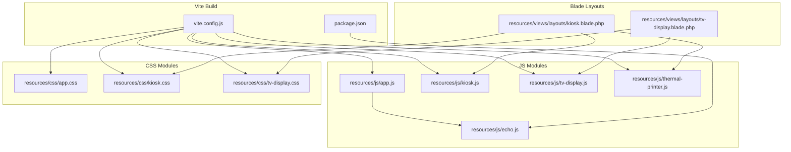
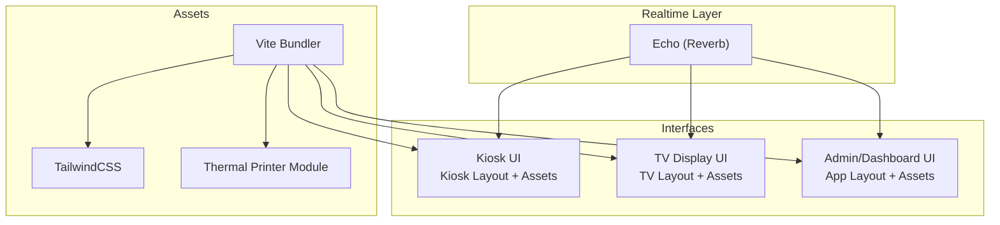
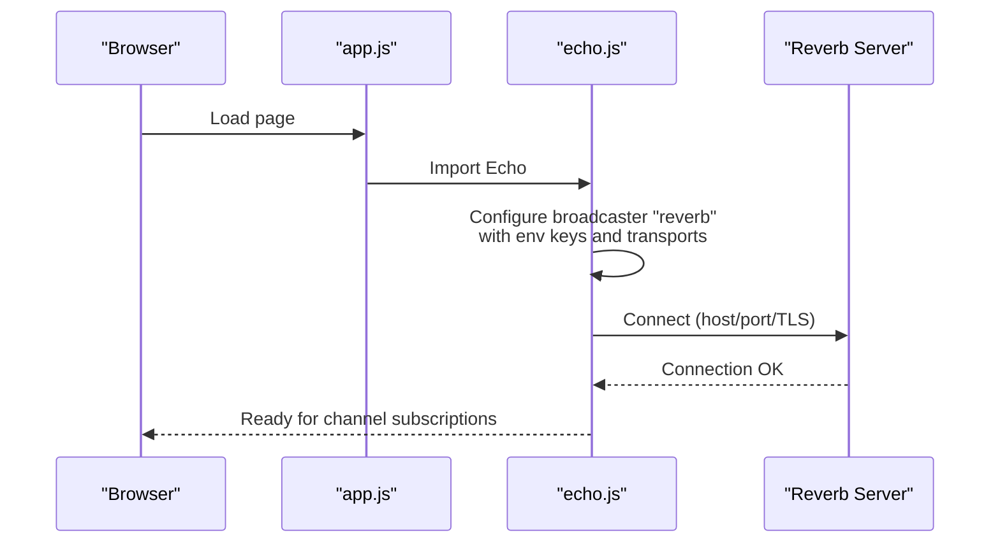
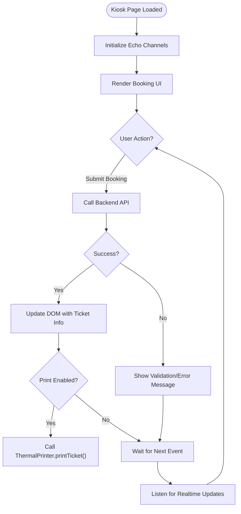
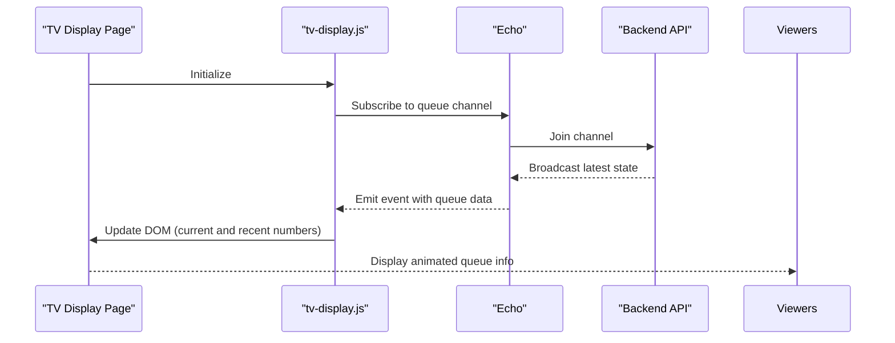
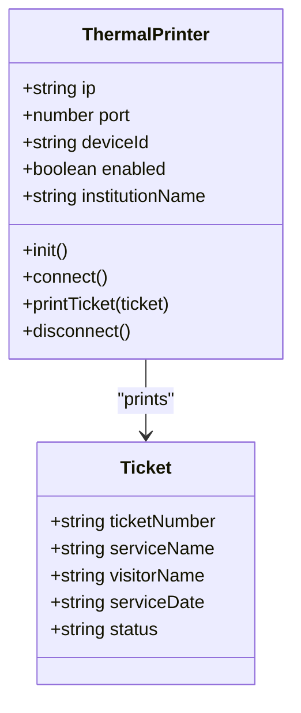
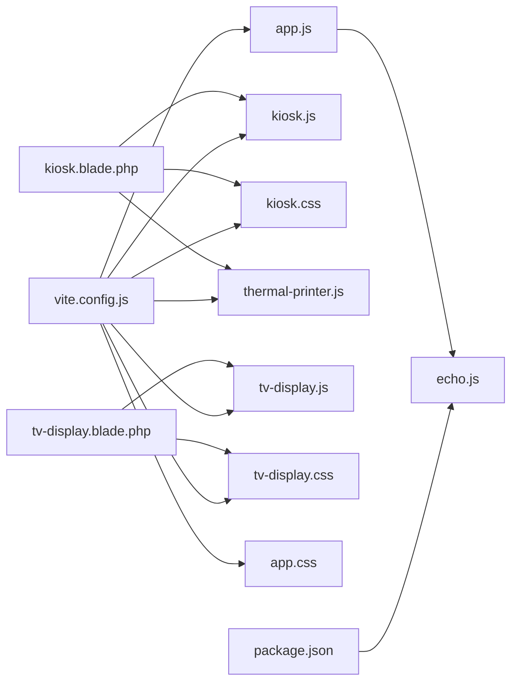

# JavaScript and Frontend Assets

<cite>
**Referenced Files in This Document**
- [app.js](file://resources/js/app.js)
- [echo.js](file://resources/js/echo.js)
- [kiosk.js](file://resources/js/kiosk.js)
- [tv-display.js](file://resources/js/tv-display.js)
- [thermal-printer.js](file://resources/js/thermal-printer.js)
- [vite.config.js](file://vite.config.js)
- [package.json](file://package.json)
- [app.css](file://resources/css/app.css)
- [kiosk.css](file://resources/css/kiosk.css)
- [tv-display.css](file://resources/css/tv-display.css)
- [kiosk.blade.php](file://resources/views/layouts/kiosk.blade.php)
- [tv-display.blade.php](file://resources/views/layouts/tv-display.blade.php)
- [web.php](file://routes/web.php)
</cite>

## Table of Contents
1. [Introduction](#introduction)
2. [Project Structure](#project-structure)
3. [Core Components](#core-components)
4. [Architecture Overview](#architecture-overview)
5. [Detailed Component Analysis](#detailed-component-analysis)
6. [Dependency Analysis](#dependency-analysis)
7. [Performance Considerations](#performance-considerations)
8. [Troubleshooting Guide](#troubleshooting-guide)
9. [Conclusion](#conclusion)
10. [Appendices](#appendices)

## Introduction
This document explains the JavaScript frontend implementation and asset management for the PTSP queue management system. It covers the modular architecture, real-time capabilities via Echo and Reverb, specialized scripts for kiosk and TV display interfaces, thermal printer integration, and the TailwindCSS-based styling system. It also includes guidance on DOM manipulation, event handling, real-time updates, browser compatibility, performance optimization, asset bundling with Vite, and development versus production configurations.

## Project Structure
The frontend is organized around three primary entry points:
- Shared application initialization and Echo integration
- Kiosk interface assets
- TV display assets
- Thermal printer module for Epson ePOS SDK
- TailwindCSS configuration and custom styles for each interface

**Diagram sources**
- [vite.config.js:1-37](file://vite.config.js#L1-L37)
- [package.json:1-28](file://package.json#L1-L28)
- [app.js:1-10](file://resources/js/app.js#L1-L10)
- [echo.js:1-15](file://resources/js/echo.js#L1-L15)
- [kiosk.js:1-2](file://resources/js/kiosk.js#L1-L2)
- [tv-display.js:1-2](file://resources/js/tv-display.js#L1-L2)
- [thermal-printer.js:1-139](file://resources/js/thermal-printer.js#L1-L139)
- [kiosk.css:1-8](file://resources/css/kiosk.css#L1-L8)
- [tv-display.css:1-18](file://resources/css/tv-display.css#L1-L18)
- [app.css:1-140](file://resources/css/app.css#L1-L140)
- [kiosk.blade.php:1-67](file://resources/views/layouts/kiosk.blade.php#L1-L67)
- [tv-display.blade.php:1-31](file://resources/views/layouts/tv-display.blade.php#L1-L31)

**Section sources**
- [vite.config.js:1-37](file://vite.config.js#L1-L37)
- [package.json:1-28](file://package.json#L1-L28)
- [kiosk.blade.php:1-67](file://resources/views/layouts/kiosk.blade.php#L1-L67)
- [tv-display.blade.php:1-31](file://resources/views/layouts/tv-display.blade.php#L1-L31)

## Core Components
- Application initializer and Echo bridge
  - The shared application entry initializes Echo for real-time event broadcasting.
  - See [app.js:1-10](file://resources/js/app.js#L1-L10) and [echo.js:1-15](file://resources/js/echo.js#L1-L15).
- Kiosk interface
  - Dedicated JS/CSS for self-service booking and display.
  - See [kiosk.js:1-2](file://resources/js/kiosk.js#L1-L2) and [kiosk.css:1-8](file://resources/css/kiosk.css#L1-L8).
- TV display interface
  - Dedicated JS/CSS for large-screen queue announcements.
  - See [tv-display.js:1-2](file://resources/js/tv-display.js#L1-L2) and [tv-display.css:1-18](file://resources/css/tv-display.css#L1-L18).
- Thermal printer integration
  - Epson ePOS SDK-based module for ESC/POS native printing.
  - See [thermal-printer.js:1-139](file://resources/js/thermal-printer.js#L1-L139).
- Asset bundling and TailwindCSS
  - Vite configuration registers all entry points and enables TailwindCSS.
  - See [vite.config.js:1-37](file://vite.config.js#L1-L37) and [package.json:1-28](file://package.json#L1-L28).
- Blade layouts
  - Kiosk and TV display layouts load their respective assets and optional thermal printer SDK.
  - See [kiosk.blade.php:1-67](file://resources/views/layouts/kiosk.blade.php#L1-L67) and [tv-display.blade.php:1-31](file://resources/views/layouts/tv-display.blade.php#L1-L31).

**Section sources**
- [app.js:1-10](file://resources/js/app.js#L1-L10)
- [echo.js:1-15](file://resources/js/echo.js#L1-L15)
- [kiosk.js:1-2](file://resources/js/kiosk.js#L1-L2)
- [tv-display.js:1-2](file://resources/js/tv-display.js#L1-L2)
- [thermal-printer.js:1-139](file://resources/js/thermal-printer.js#L1-L139)
- [vite.config.js:1-37](file://vite.config.js#L1-L37)
- [package.json:1-28](file://package.json#L1-L28)
- [kiosk.css:1-8](file://resources/css/kiosk.css#L1-L8)
- [tv-display.css:1-18](file://resources/css/tv-display.css#L1-L18)
- [kiosk.blade.php:1-67](file://resources/views/layouts/kiosk.blade.php#L1-L67)
- [tv-display.blade.php:1-31](file://resources/views/layouts/tv-display.blade.php#L1-L31)

## Architecture Overview
The frontend architecture separates concerns by interface while sharing a common Echo-based real-time foundation. Vite bundles assets per layout, TailwindCSS provides design tokens and utilities, and the thermal printer module integrates with the Epson ePOS SDK for native ESC/POS output.

**Diagram sources**
- [echo.js:1-15](file://resources/js/echo.js#L1-L15)
- [kiosk.blade.php:1-67](file://resources/views/layouts/kiosk.blade.php#L1-L67)
- [tv-display.blade.php:1-31](file://resources/views/layouts/tv-display.blade.php#L1-L31)
- [vite.config.js:1-37](file://vite.config.js#L1-L37)
- [app.css:1-140](file://resources/css/app.css#L1-L140)

## Detailed Component Analysis

### Real-Time Communication via Echo and Reverb
- Initialization
  - Echo is instantiated with Reverb as the broadcaster and configured with environment variables for host, port, TLS, and transports.
  - See [echo.js:1-15](file://resources/js/echo.js#L1-L15).
- Application integration
  - The shared application entry imports Echo so all pages can subscribe to channels and listen for broadcasts.
  - See [app.js:1-10](file://resources/js/app.js#L1-L10).
- Routes and authentication
  - Kiosk and TV display use module-specific password middleware to protect their public-access pages.
  - See [web.php:92-124](file://routes/web.php#L92-L124).

**Diagram sources**
- [app.js:1-10](file://resources/js/app.js#L1-L10)
- [echo.js:1-15](file://resources/js/echo.js#L1-L15)

**Section sources**
- [echo.js:1-15](file://resources/js/echo.js#L1-L15)
- [app.js:1-10](file://resources/js/app.js#L1-L10)
- [web.php:92-124](file://routes/web.php#L92-L124)

### Kiosk Operations Script
- Purpose
  - Provides the JS entry point for the kiosk interface and integrates with Livewire and Flux.
- Asset loading
  - The kiosk layout loads kiosk CSS and JS via Vite and conditionally includes the thermal printer SDK and module when enabled.
  - See [kiosk.blade.php:16-42](file://resources/views/layouts/kiosk.blade.php#L16-L42).
- Thermal printer integration
  - The thermal printer module exposes a factory-style API to initialize, connect, print tickets, and disconnect.
  - See [thermal-printer.js:1-139](file://resources/js/thermal-printer.js#L1-L139).
- DOM and event handling patterns
  - Typical patterns include binding click handlers to actions, updating DOM nodes with current queue state, and triggering printer operations after successful booking.
  - These patterns are implemented within Livewire components and Blade views; refer to the kiosk layout for asset wiring.

**Diagram sources**
- [kiosk.blade.php:16-42](file://resources/views/layouts/kiosk.blade.php#L16-L42)
- [thermal-printer.js:54-128](file://resources/js/thermal-printer.js#L54-L128)

**Section sources**
- [kiosk.js:1-2](file://resources/js/kiosk.js#L1-L2)
- [kiosk.blade.php:1-67](file://resources/views/layouts/kiosk.blade.php#L1-L67)
- [thermal-printer.js:1-139](file://resources/js/thermal-printer.js#L1-L139)

### TV Display Functionality
- Purpose
  - Dedicated interface for displaying live queue announcements on large screens.
- Asset loading
  - The TV layout loads TV-specific CSS and JS via Vite and applies dark-themed styles optimized for large displays.
  - See [tv-display.blade.php:16-28](file://resources/views/layouts/tv-display.blade.php#L16-L28).
- Animations and responsive design
  - Tailwind utilities and custom keyframes provide pulsing and marquee effects suited for TV screens.
  - See [tv-display.css:1-18](file://resources/css/tv-display.css#L1-L18) and [app.css:68-79](file://resources/css/app.css#L68-L79).

**Diagram sources**
- [tv-display.js:1-2](file://resources/js/tv-display.js#L1-L2)
- [tv-display.blade.php:16-28](file://resources/views/layouts/tv-display.blade.php#L16-L28)
- [echo.js:1-15](file://resources/js/echo.js#L1-L15)

**Section sources**
- [tv-display.js:1-2](file://resources/js/tv-display.js#L1-L2)
- [tv-display.blade.php:1-31](file://resources/views/layouts/tv-display.blade.php#L1-L31)
- [tv-display.css:1-18](file://resources/css/tv-display.css#L1-L18)
- [app.css:68-79](file://resources/css/app.css#L68-L79)

### Thermal Printer Integration Script
- SDK and protocol
  - Uses Epson ePOS SDK to communicate with an Epson TM-M30II thermal printer over network using ESC/POS native commands.
- Initialization and connection
  - Initializes the ePOSDevice, connects to the configured IP/port, and creates a printer device handle upon success.
- Printing logic
  - Formats ticket content with institution branding, ticket number, service details, barcode, and cut command.
- Lifecycle
  - Supports disconnect to release resources cleanly.

**Diagram sources**
- [thermal-printer.js:5-139](file://resources/js/thermal-printer.js#L5-L139)

**Section sources**
- [thermal-printer.js:1-139](file://resources/js/thermal-printer.js#L1-L139)
- [kiosk.blade.php:38-42](file://resources/views/layouts/kiosk.blade.php#L38-L42)

### CSS Architecture and Responsive Design
- TailwindCSS configuration
  - Tailwind is imported globally and customized with theme tokens, dark mode variants, and Flux UI integration.
  - See [app.css:1-140](file://resources/css/app.css#L1-L140).
- Interface-specific styles
  - Kiosk and TV display have dedicated CSS files that import Tailwind and source directives for their Blade templates.
  - See [kiosk.css:1-8](file://resources/css/kiosk.css#L1-L8) and [tv-display.css:1-18](file://resources/css/tv-display.css#L1-L18).
- Animations and utilities
  - Pulse and marquee animations are defined for TV display emphasis.
  - See [app.css:68-79](file://resources/css/app.css#L68-L79) and [tv-display.css:6-17](file://resources/css/tv-display.css#L6-L17).
- Responsive design
  - Viewport meta tags and Tailwind utilities ensure mobile-friendly layouts for kiosk touchscreens and large-screen readability for TV displays.
  - See [kiosk.blade.php:4-5](file://resources/views/layouts/kiosk.blade.php#L4-L5) and [tv-display.blade.php:4-5](file://resources/views/layouts/tv-display.blade.php#L4-L5).

**Section sources**
- [app.css:1-140](file://resources/css/app.css#L1-L140)
- [kiosk.css:1-8](file://resources/css/kiosk.css#L1-L8)
- [tv-display.css:1-18](file://resources/css/tv-display.css#L1-L18)
- [kiosk.blade.php:4-5](file://resources/views/layouts/kiosk.blade.php#L4-L5)
- [tv-display.blade.php:4-5](file://resources/views/layouts/tv-display.blade.php#L4-L5)

### DOM Manipulation, Event Handling, and Real-Time Updates
- DOM updates
  - Real-time updates modify visible elements such as current ticket number, recent history, and status indicators.
- Event handling
  - Click handlers trigger actions (e.g., booking submission), and Livewire manages state transitions.
- Real-time synchronization
  - Echo channels push updates to subscribed clients, ensuring UI reflects backend state instantly.

[No sources needed since this section provides general guidance]

## Dependency Analysis
- Internal dependencies
  - app.js depends on echo.js for real-time features.
  - Kiosk and TV layouts depend on their respective JS/CSS modules.
  - Kiosk layout optionally depends on thermal-printer.js when enabled.
- External dependencies
  - Vite builds assets and integrates TailwindCSS and Laravel Vite plugin.
  - Echo uses Pusher-JS under the hood with Reverb as the broadcaster.
- Environment configuration
  - Echo reads environment variables for Reverb key/host/port/scheme.

**Diagram sources**
- [app.js:1-10](file://resources/js/app.js#L1-L10)
- [echo.js:1-15](file://resources/js/echo.js#L1-L15)
- [kiosk.js:1-2](file://resources/js/kiosk.js#L1-L2)
- [tv-display.js:1-2](file://resources/js/tv-display.js#L1-L2)
- [thermal-printer.js:1-139](file://resources/js/thermal-printer.js#L1-L139)
- [kiosk.css:1-8](file://resources/css/kiosk.css#L1-L8)
- [tv-display.css:1-18](file://resources/css/tv-display.css#L1-L18)
- [app.css:1-140](file://resources/css/app.css#L1-L140)
- [kiosk.blade.php:16-42](file://resources/views/layouts/kiosk.blade.php#L16-L42)
- [tv-display.blade.php:16-28](file://resources/views/layouts/tv-display.blade.php#L16-L28)
- [vite.config.js:1-37](file://vite.config.js#L1-L37)
- [package.json:1-28](file://package.json#L1-L28)

**Section sources**
- [vite.config.js:1-37](file://vite.config.js#L1-L37)
- [package.json:1-28](file://package.json#L1-L28)
- [kiosk.blade.php:16-42](file://resources/views/layouts/kiosk.blade.php#L16-L42)
- [tv-display.blade.php:16-28](file://resources/views/layouts/tv-display.blade.php#L16-L28)

## Performance Considerations
- Asset bundling with Vite
  - Register only necessary entries to minimize bundle size; current configuration includes all interface assets.
  - See [vite.config.js:10-21](file://vite.config.js#L10-L21).
- TailwindCSS optimization
  - Purge unused styles via source globs; Tailwind source directives target Blade templates for each interface.
  - See [app.css:4-7](file://resources/css/app.css#L4-L7), [kiosk.css:4-7](file://resources/css/kiosk.css#L4-L7), [tv-display.css:3-4](file://resources/css/tv-display.css#L3-L4).
- Real-time overhead
  - Limit channel subscriptions to required scopes and unsubscribe on navigation to reduce bandwidth and CPU usage.
- Thermal printer operations
  - Batch or debounce print requests to avoid overwhelming the printer and network stack.
- Development vs production
  - Use Vite dev server during development; ensure production builds are served via Laravel’s asset pipeline.

[No sources needed since this section provides general guidance]

## Troubleshooting Guide
- Echo/Reverb connectivity
  - Verify environment variables for Reverb key/host/port/scheme and ensure the broadcaster is reachable.
  - See [echo.js:6-14](file://resources/js/echo.js#L6-L14).
- Thermal printer not responding
  - Confirm the Epson ePOS SDK is loaded and the printer is reachable at the configured IP/port; check printer connection state and device ID.
  - See [kiosk.blade.php:38-42](file://resources/views/layouts/kiosk.blade.php#L38-L42) and [thermal-printer.js:24-46](file://resources/js/thermal-printer.js#L24-L46).
- Assets not loading
  - Ensure Vite is running in development or build artifacts are generated; confirm Blade layouts include the correct Vite entries.
  - See [kiosk.blade.php](file://resources/views/layouts/kiosk.blade.php#L16) and [tv-display.blade.php](file://resources/views/layouts/tv-display.blade.php#L16).
- Real-time updates not appearing
  - Confirm the client is subscribed to the correct channel and the backend emits events to that channel.
  - See [web.php:92-124](file://routes/web.php#L92-L124) for protected routes and channel usage.

**Section sources**
- [echo.js:6-14](file://resources/js/echo.js#L6-L14)
- [kiosk.blade.php:38-42](file://resources/views/layouts/kiosk.blade.php#L38-L42)
- [thermal-printer.js:24-46](file://resources/js/thermal-printer.js#L24-L46)
- [kiosk.blade.php](file://resources/views/layouts/kiosk.blade.php#L16)
- [tv-display.blade.php](file://resources/views/layouts/tv-display.blade.php#L16)
- [web.php:92-124](file://routes/web.php#L92-L124)

## Conclusion
The frontend leverages a clean modular architecture with Vite for asset bundling, TailwindCSS for consistent design, and Echo with Reverb for real-time updates. Kiosk and TV display share a unified Echo foundation while maintaining distinct UI assets and optional thermal printer integration. Following the outlined patterns ensures maintainable, performant, and scalable frontend behavior across devices and environments.

## Appendices
- Development and production configuration
  - Scripts for dev/build are defined in package.json; Vite server settings are configured in vite.config.js.
  - See [package.json:5-8](file://package.json#L5-L8) and [vite.config.js:23-36](file://vite.config.js#L23-L36).
- Environment variables for Echo
  - Reverb-related variables are consumed in echo.js; ensure they are set in your environment.
  - See [echo.js:8-13](file://resources/js/echo.js#L8-L13).

**Section sources**
- [package.json:5-8](file://package.json#L5-L8)
- [vite.config.js:23-36](file://vite.config.js#L23-L36)
- [echo.js:8-13](file://resources/js/echo.js#L8-L13)