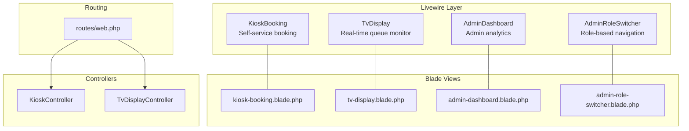
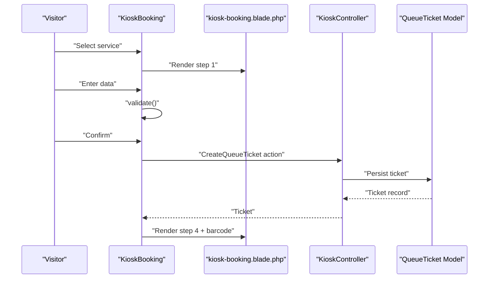
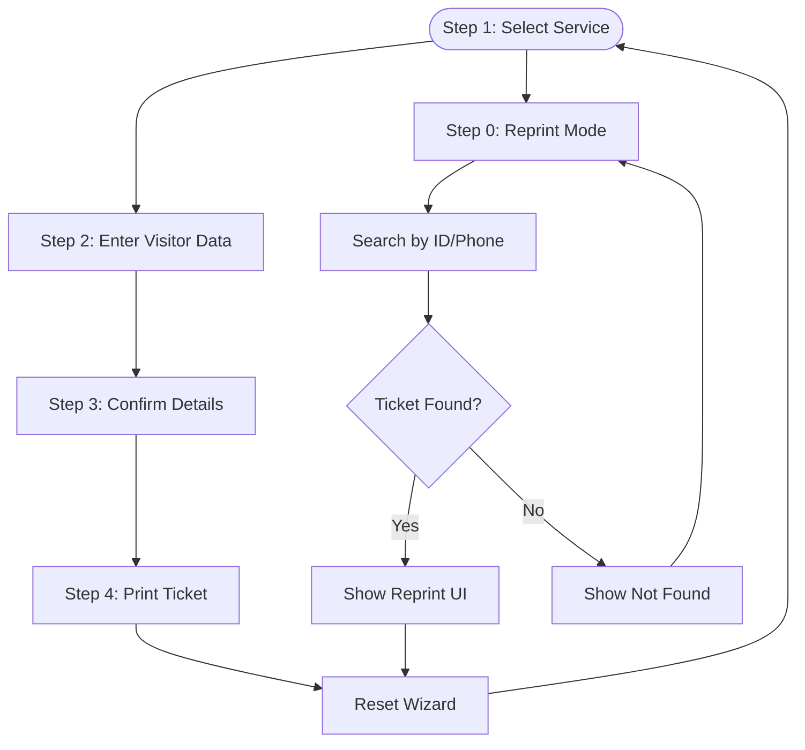
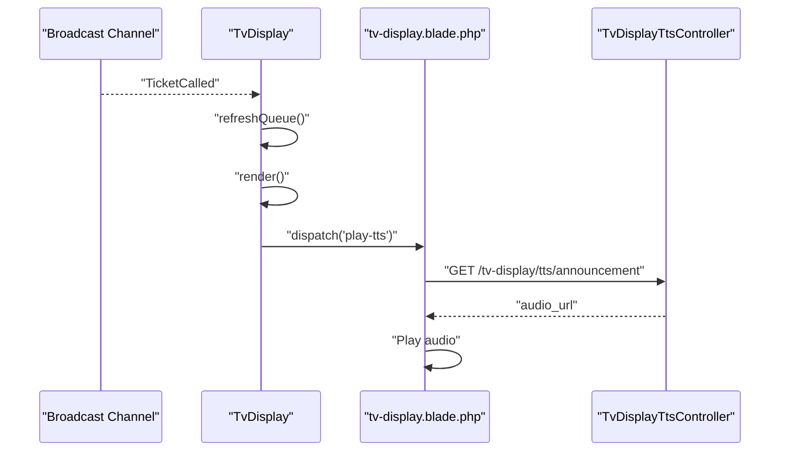
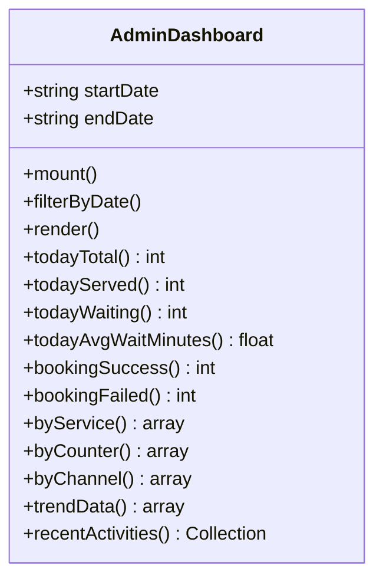
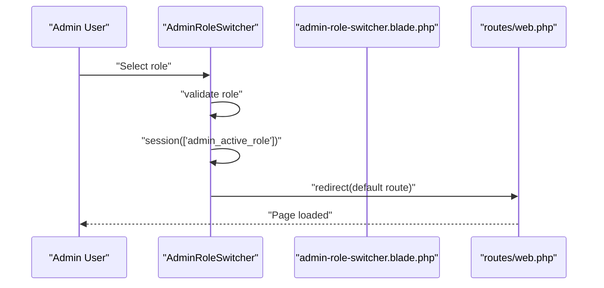
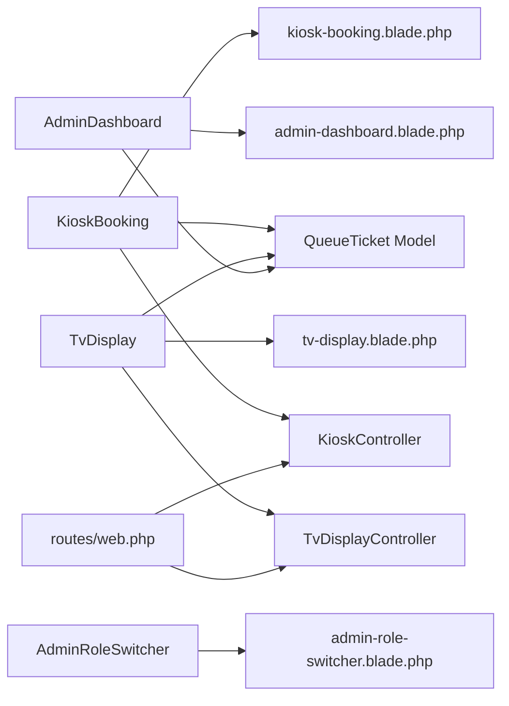
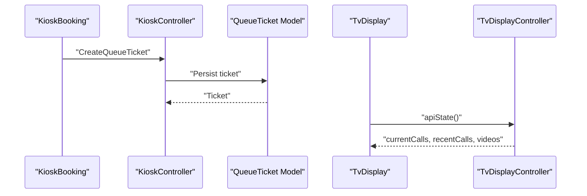

# Livewire Components

<cite>
**Referenced Files in This Document**
- [KioskBooking.php](file://app/Livewire/KioskBooking.php)
- [TvDisplay.php](file://app/Livewire/TvDisplay.php)
- [AdminDashboard.php](file://app/Livewire/Dashboard/AdminDashboard.php)
- [AdminRoleSwitcher.php](file://app/Livewire/AdminRoleSwitcher.php)
- [kiosk-booking.blade.php](file://resources/views/livewire/kiosk-booking.blade.php)
- [tv-display.blade.php](file://resources/views/livewire/tv-display.blade.php)
- [admin-role-switcher.blade.php](file://resources/views/livewire/admin-role-switcher.blade.php)
- [admin-dashboard.blade.php](file://resources/views/livewire/dashboard/admin-dashboard.blade.php)
- [KioskController.php](file://app/Http/Controllers/KioskController.php)
- [TvDisplayController.php](file://app/Http/Controllers/TvDisplayController.php)
- [web.php](file://routes/web.php)
- [QueueTicket.php](file://app/Models/QueueTicket.php)
- [kiosk.blade.php](file://resources/views/components/layouts/kiosk.blade.php)
- [tv-display.blade.php](file://resources/views/components/layouts/tv-display.blade.php)
- [Logout.php](file://app/Livewire/Actions/Logout.php)
</cite>

## Table of Contents
1. [Introduction](#introduction)
2. [Project Structure](#project-structure)
3. [Core Components](#core-components)
4. [Architecture Overview](#architecture-overview)
5. [Detailed Component Analysis](#detailed-component-analysis)
6. [Dependency Analysis](#dependency-analysis)
7. [Performance Considerations](#performance-considerations)
8. [Security Considerations](#security-considerations)
9. [Integration with Backend](#integration-with-backend)
10. [Troubleshooting Guide](#troubleshooting-guide)
11. [Conclusion](#conclusion)

## Introduction
This document explains the Livewire component architecture powering the PTSP system’s user-facing modules. It focuses on how Livewire enables reactive UI without traditional AJAX by bridging PHP components with Blade templates and Alpine.js-driven interactivity. The documentation covers component lifecycle, state management, event handling, and real-time updates, with detailed analysis of four major components: KioskBooking for self-service booking, TvDisplay for real-time queue monitoring, AdminDashboard for administrative insights, and AdminRoleSwitcher for role-based navigation.

## Project Structure
Livewire components live under app/Livewire and are paired with Blade views under resources/views/livewire. Each component defines public properties for state, methods for behavior, computed properties for derived data, and event handlers for Livewire and Alpine.js. Controllers under app/Http/Controllers handle module-specific authentication and legacy APIs, while routes/web.php wires module access and permissions.

**Diagram sources**
- [KioskBooking.php:25-288](file://app/Livewire/KioskBooking.php#L25-L288)
- [TvDisplay.php:18-142](file://app/Livewire/TvDisplay.php#L18-L142)
- [AdminDashboard.php:12-233](file://app/Livewire/Dashboard/AdminDashboard.php#L12-L233)
- [AdminRoleSwitcher.php:9-52](file://app/Livewire/AdminRoleSwitcher.php#L9-L52)
- [kiosk-booking.blade.php:1-588](file://resources/views/livewire/kiosk-booking.blade.php#L1-L588)
- [tv-display.blade.php:1-213](file://resources/views/livewire/tv-display.blade.php#L1-L213)
- [admin-dashboard.blade.php:1-356](file://resources/views/livewire/dashboard/admin-dashboard.blade.php#L1-L356)
- [admin-role-switcher.blade.php:1-8](file://resources/views/livewire/admin-role-switcher.blade.php#L1-L8)
- [KioskController.php:18-144](file://app/Http/Controllers/KioskController.php#L18-L144)
- [TvDisplayController.php:16-144](file://app/Http/Controllers/TvDisplayController.php#L16-L144)
- [web.php:92-124](file://routes/web.php#L92-L124)

**Section sources**
- [KioskBooking.php:25-288](file://app/Livewire/KioskBooking.php#L25-L288)
- [TvDisplay.php:18-142](file://app/Livewire/TvDisplay.php#L18-L142)
- [AdminDashboard.php:12-233](file://app/Livewire/Dashboard/AdminDashboard.php#L12-L233)
- [AdminRoleSwitcher.php:9-52](file://app/Livewire/AdminRoleSwitcher.php#L9-L52)
- [kiosk-booking.blade.php:1-588](file://resources/views/livewire/kiosk-booking.blade.php#L1-L588)
- [tv-display.blade.php:1-213](file://resources/views/livewire/tv-display.blade.php#L1-L213)
- [admin-dashboard.blade.php:1-356](file://resources/views/livewire/dashboard/admin-dashboard.blade.php#L1-L356)
- [admin-role-switcher.blade.php:1-8](file://resources/views/livewire/admin-role-switcher.blade.php#L1-L8)
- [KioskController.php:18-144](file://app/Http/Controllers/KioskController.php#L18-L144)
- [TvDisplayController.php:16-144](file://app/Http/Controllers/TvDisplayController.php#L16-L144)
- [web.php:92-124](file://routes/web.php#L92-L124)

## Core Components
- KioskBooking: Multi-step wizard for walk-in visitors to select a service, enter personal data, confirm, and print a ticket. Uses computed properties for services and selectable regions, and emits Alpine events for thermal printer integration.
- TvDisplay: Real-time queue monitor that listens for broadcast events, announces calls via TTS, and streams local or YouTube videos.
- AdminDashboard: Administrative analytics dashboard with date-range filtering, computed metrics, and auto-refreshing activity feed.
- AdminRoleSwitcher: Role-based navigation component that validates roles and redirects to appropriate default pages.

Each component exposes:
- Public properties for state
- Methods for user actions and validations
- Computed properties for derived data
- Event handlers for Livewire and Alpine.js

**Section sources**
- [KioskBooking.php:25-288](file://app/Livewire/KioskBooking.php#L25-L288)
- [TvDisplay.php:18-142](file://app/Livewire/TvDisplay.php#L18-L142)
- [AdminDashboard.php:12-233](file://app/Livewire/Dashboard/AdminDashboard.php#L12-L233)
- [AdminRoleSwitcher.php:9-52](file://app/Livewire/AdminRoleSwitcher.php#L9-L52)

## Architecture Overview
Livewire components are rendered server-side and hydrated client-side. Blade templates bind component properties and methods to UI controls. Alpine.js manages interactive behaviors (e.g., printing, video playback, audio unlocking). Controllers handle module authentication and legacy endpoints. Broadcasting and caching enable real-time updates and performance.

**Diagram sources**
- [KioskBooking.php:155-180](file://app/Livewire/KioskBooking.php#L155-L180)
- [kiosk-booking.blade.php:475-569](file://resources/views/livewire/kiosk-booking.blade.php#L475-L569)
- [KioskController.php:114-142](file://app/Http/Controllers/KioskController.php#L114-L142)
- [QueueTicket.php:12-121](file://app/Models/QueueTicket.php#L12-L121)

**Section sources**
- [KioskBooking.php:126-180](file://app/Livewire/KioskBooking.php#L126-L180)
- [kiosk-booking.blade.php:475-569](file://resources/views/livewire/kiosk-booking.blade.php#L475-L569)
- [KioskController.php:114-142](file://app/Http/Controllers/KioskController.php#L114-L142)
- [QueueTicket.php:12-121](file://app/Models/QueueTicket.php#L12-L121)

## Detailed Component Analysis

### KioskBooking Component
- Purpose: Self-service booking for walk-in visitors with a guided wizard.
- Lifecycle:
  - Properties: step, selectedServiceId, visitorName, visitorIdentifier, visitorPhone, visitorWilayahKode/Nama, ticket, fontSize, barcodeSvg, reprint modes.
  - Computed: services (persisted), selectedService, wilayahOptions (persisted).
  - Methods: selectService, goBack, toggleFontSize, selectWilayah, updatedVisitorWilayahKode, submitData, confirmBooking, loadBarcode, resetWizard, enterReprintMode, exitReprintMode, searchTicketForReprint.
- Real-time and interactivity:
  - Alpine.js integration for thermal printer via window events.
  - Barcode generation and SVG embedding.
- Validation and persistence:
  - Form validation with localized messages.
  - Computed properties cached for performance.

**Diagram sources**
- [KioskBooking.php:27-206](file://app/Livewire/KioskBooking.php#L27-L206)
- [kiosk-booking.blade.php:15-132](file://resources/views/livewire/kiosk-booking.blade.php#L15-L132)

**Section sources**
- [KioskBooking.php:25-288](file://app/Livewire/KioskBooking.php#L25-L288)
- [kiosk-booking.blade.php:1-588](file://resources/views/livewire/kiosk-booking.blade.php#L1-L588)

### TvDisplay Component
- Purpose: Real-time queue monitor with call announcements and video playback.
- Lifecycle:
  - Properties: lastAnnouncedCall.
  - Methods: render (triggers refresh), checkAndAnnounce, formatForTts, currentCalls, recentCalls, videos.
  - Event handling: #[On('echo:public-queue,TicketCalled')] refreshQueue.
- Real-time updates:
  - Listens for broadcast events and re-renders to trigger announcements.
  - Dispatches Alpine events to play TTS audio.
- Media:
  - Loads videos from storage with caching and falls back to YouTube playlist.

**Diagram sources**
- [TvDisplay.php:22-68](file://app/Livewire/TvDisplay.php#L22-L68)
- [tv-display.blade.php:30-40](file://resources/views/livewire/tv-display.blade.php#L30-L40)
- [web.php:122-124](file://routes/web.php#L122-L124)

**Section sources**
- [TvDisplay.php:18-142](file://app/Livewire/TvDisplay.php#L18-L142)
- [tv-display.blade.php:1-213](file://resources/views/livewire/tv-display.blade.php#L1-L213)
- [web.php:108-124](file://routes/web.php#L108-L124)

### AdminDashboard Component
- Purpose: Administrative analytics and operational insights.
- Lifecycle:
  - Properties: startDate, endDate.
  - Methods: mount, filterByDate, render.
  - Computed: todayTotal, todayServed, todayWaiting, todayAvgWaitMinutes, bookingSuccess, bookingFailed, byService, byCounter, byChannel, trendData, recentActivities.
- Interactivity:
  - Date range filtering invalidates dependent computed caches.
  - Auto-refresh via wire:poll.30s on activity feed.

**Diagram sources**
- [AdminDashboard.php:12-233](file://app/Livewire/Dashboard/AdminDashboard.php#L12-L233)

**Section sources**
- [AdminDashboard.php:12-233](file://app/Livewire/Dashboard/AdminDashboard.php#L12-L233)
- [admin-dashboard.blade.php:262-308](file://resources/views/livewire/dashboard/admin-dashboard.blade.php#L262-L308)

### AdminRoleSwitcher Component
- Purpose: Role-based navigation for administrators.
- Lifecycle:
  - Properties: activeRole.
  - Methods: mount, switchRole, render.
- Behavior:
  - Validates role against enum values.
  - Stores active role in session and redirects to default route.

**Diagram sources**
- [AdminRoleSwitcher.php:29-45](file://app/Livewire/AdminRoleSwitcher.php#L29-L45)
- [admin-role-switcher.blade.php:1-8](file://resources/views/livewire/admin-role-switcher.blade.php#L1-L8)
- [web.php:62-90](file://routes/web.php#L62-L90)

**Section sources**
- [AdminRoleSwitcher.php:9-52](file://app/Livewire/AdminRoleSwitcher.php#L9-L52)
- [admin-role-switcher.blade.php:1-8](file://resources/views/livewire/admin-role-switcher.blade.php#L1-L8)
- [web.php:62-90](file://routes/web.php#L62-L90)

## Dependency Analysis
- Component-to-Blade: Each component renders a dedicated Blade view that binds properties and methods to UI controls.
- Component-to-Model: KioskBooking and TvDisplay rely on QueueTicket and related models for data queries.
- Component-to-Controller: KioskBooking delegates ticket creation to a controller-backed action; TvDisplay relies on controllers for TTS and legacy APIs.
- Routing: Module routes enforce middleware-based authentication and module passwords.
- Layouts: Components use shared layout wrappers for consistent styling and behavior.

**Diagram sources**
- [KioskBooking.php:5-11](file://app/Livewire/KioskBooking.php#L5-L11)
- [TvDisplay.php:5-10](file://app/Livewire/TvDisplay.php#L5-L10)
- [AdminDashboard.php:5-8](file://app/Livewire/Dashboard/AdminDashboard.php#L5-L8)
- [QueueTicket.php:12-121](file://app/Models/QueueTicket.php#L12-L121)
- [KioskController.php:18-144](file://app/Http/Controllers/KioskController.php#L18-L144)
- [TvDisplayController.php:16-144](file://app/Http/Controllers/TvDisplayController.php#L16-L144)
- [kiosk-booking.blade.php:1-588](file://resources/views/livewire/kiosk-booking.blade.php#L1-L588)
- [tv-display.blade.php:1-213](file://resources/views/livewire/tv-display.blade.php#L1-L213)
- [admin-dashboard.blade.php:1-356](file://resources/views/livewire/dashboard/admin-dashboard.blade.php#L1-L356)
- [admin-role-switcher.blade.php:1-8](file://resources/views/livewire/admin-role-switcher.blade.php#L1-L8)
- [web.php:92-124](file://routes/web.php#L92-L124)

**Section sources**
- [KioskBooking.php:5-11](file://app/Livewire/KioskBooking.php#L5-L11)
- [TvDisplay.php:5-10](file://app/Livewire/TvDisplay.php#L5-L10)
- [AdminDashboard.php:5-8](file://app/Livewire/Dashboard/AdminDashboard.php#L5-L8)
- [QueueTicket.php:12-121](file://app/Models/QueueTicket.php#L12-L121)
- [web.php:92-124](file://routes/web.php#L92-L124)

## Performance Considerations
- Computed property caching:
  - KioskBooking uses persisted computed properties for services and wilayahOptions to reduce repeated queries.
  - AdminDashboard uses persisted computed metrics to minimize database load.
- Lazy initialization:
  - TvDisplay loads videos from storage with short-term caching and falls back to YouTube to avoid heavy network requests.
- Polling:
  - AdminDashboard uses wire:poll.30s for recent activities to balance freshness and server load.
- Rendering:
  - Blade templates leverage Alpine.js for lightweight DOM manipulation and event handling, reducing server round trips.

[No sources needed since this section provides general guidance]

## Security Considerations
- Authentication:
  - Kiosk and TV Display modules use separate module-password middleware to restrict access.
- Authorization:
  - Routes define role-based middleware ensuring only authorized users access admin and officer areas.
- Role switching:
  - AdminRoleSwitcher validates roles against enum values and aborts unauthorized attempts.
- Session management:
  - Logout action clears authentication and regenerates tokens.

**Section sources**
- [web.php:92-124](file://routes/web.php#L92-L124)
- [AdminRoleSwitcher.php:31-39](file://app/Livewire/AdminRoleSwitcher.php#L31-L39)
- [Logout.php:8-23](file://app/Livewire/Actions/Logout.php#L8-L23)

## Integration with Backend
- Kiosk booking:
  - KioskBooking delegates ticket creation to a controller-backed action and persists via the QueueTicket model.
  - Thermal printer integration uses Alpine dispatch events to trigger printing.
- TvDisplay:
  - Legacy API endpoints provide current/recent calls and video lists.
  - Broadcasting events trigger Livewire re-renders for real-time updates.
- AdminDashboard:
  - Computed metrics query QueueTicket and related models with date-range filters.
  - Recent activities pull from QueueActivity.

**Diagram sources**
- [KioskBooking.php:155-180](file://app/Livewire/KioskBooking.php#L155-L180)
- [KioskController.php:114-142](file://app/Http/Controllers/KioskController.php#L114-L142)
- [QueueTicket.php:12-121](file://app/Models/QueueTicket.php#L12-L121)
- [TvDisplay.php:89-140](file://app/Livewire/TvDisplay.php#L89-L140)
- [TvDisplayController.php:89-142](file://app/Http/Controllers/TvDisplayController.php#L89-L142)

**Section sources**
- [KioskBooking.php:155-180](file://app/Livewire/KioskBooking.php#L155-L180)
- [KioskController.php:114-142](file://app/Http/Controllers/KioskController.php#L114-L142)
- [QueueTicket.php:12-121](file://app/Models/QueueTicket.php#L12-L121)
- [TvDisplay.php:89-140](file://app/Livewire/TvDisplay.php#L89-L140)
- [TvDisplayController.php:89-142](file://app/Http/Controllers/TvDisplayController.php#L89-L142)

## Troubleshooting Guide
- Kiosk booking issues:
  - Validation errors surface localized messages; ensure visitor data meets constraints.
  - Region selection depends on configured region scope; verify AppSetting for active kabupaten.
- TvDisplay audio/video:
  - Audio requires user interaction to unlock browser autoplay; click overlay to enable.
  - Videos are cached; clear cache or verify storage permissions if videos fail to load.
- AdminDashboard stale data:
  - Adjust date range filters to invalidate computed caches and refresh metrics.
  - Recent activities auto-refresh; check network connectivity if updates stall.
- Role switching:
  - Ensure the user has admin role; otherwise switchRole aborts with 403.

**Section sources**
- [KioskBooking.php:144-153](file://app/Livewire/KioskBooking.php#L144-L153)
- [TvDisplay.php:120-140](file://app/Livewire/TvDisplay.php#L120-L140)
- [AdminDashboard.php:24-38](file://app/Livewire/Dashboard/AdminDashboard.php#L24-L38)
- [AdminRoleSwitcher.php:31-39](file://app/Livewire/AdminRoleSwitcher.php#L31-L39)

## Conclusion
The Livewire components in PTSP deliver a responsive, real-time user experience by combining server-side rendering with client-side interactivity. KioskBooking streamlines self-service booking, TvDisplay monitors queues with live announcements, AdminDashboard provides actionable insights, and AdminRoleSwitcher supports seamless role-based navigation. Together, they integrate tightly with controllers, models, and routing to create a cohesive, secure, and performant queue management system.