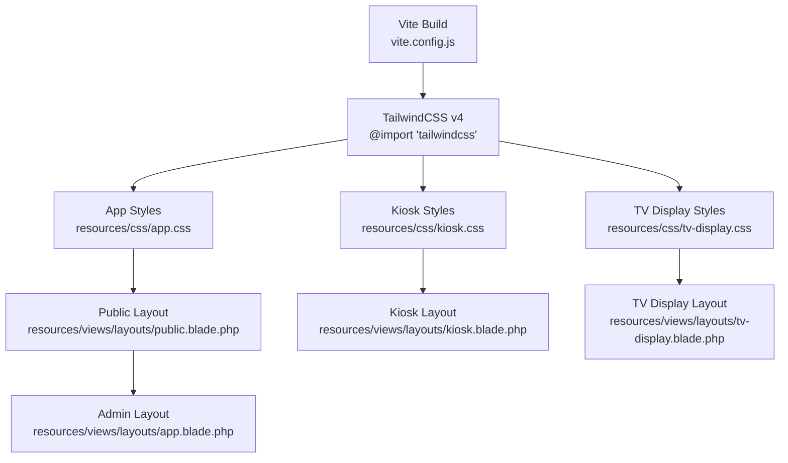
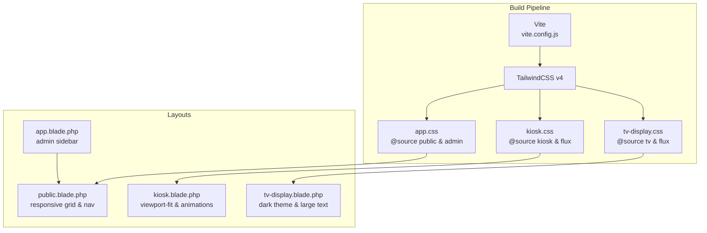
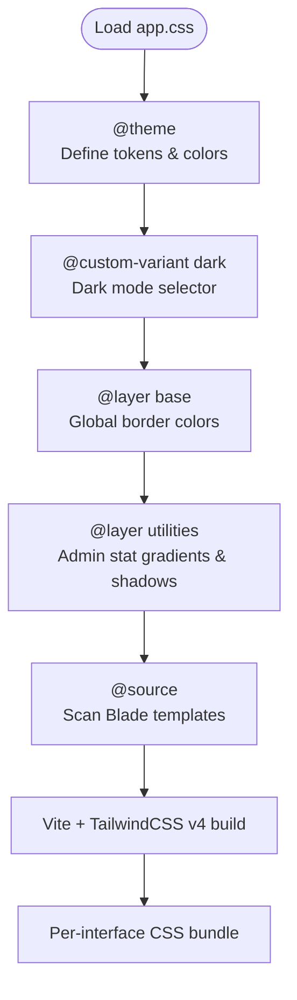
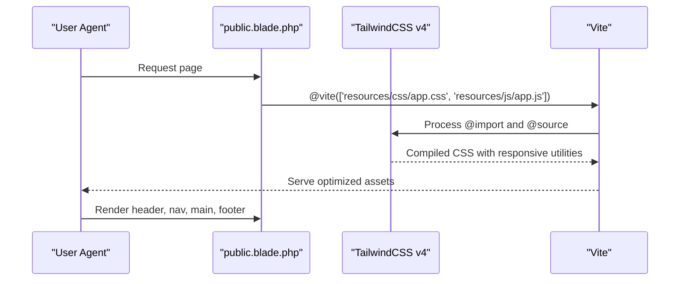
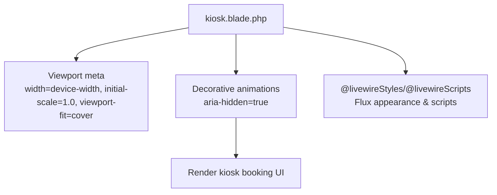
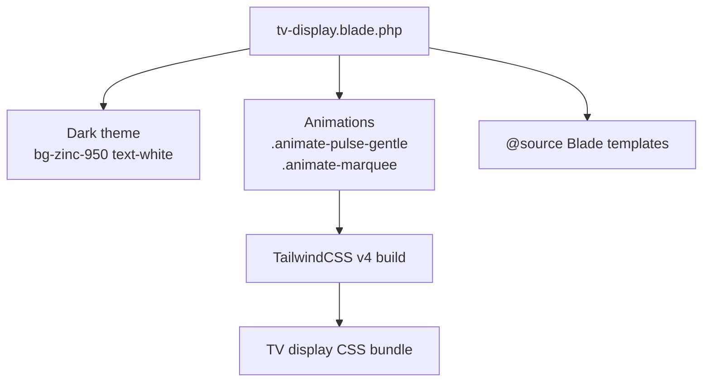
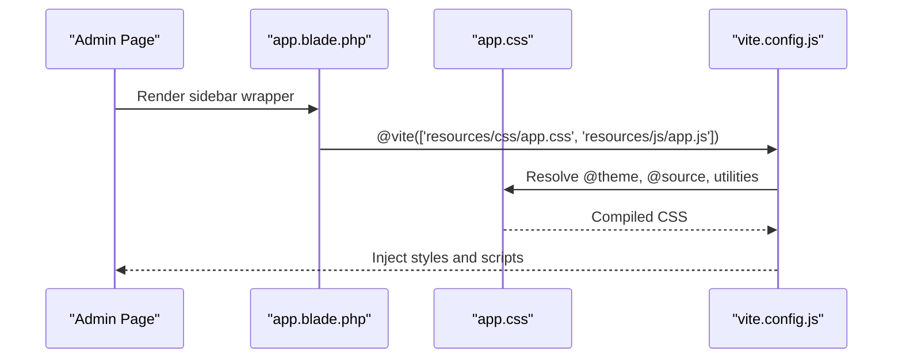
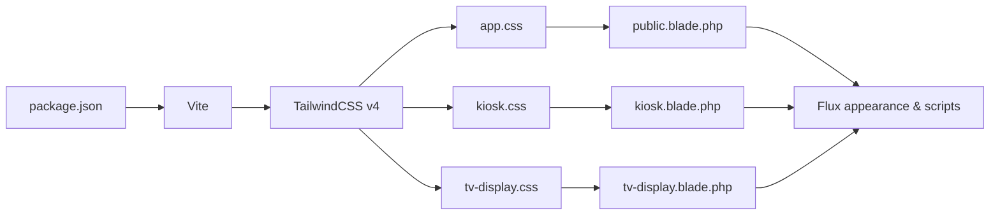

# Responsive Design and Accessibility

<cite>
**Referenced Files in This Document**
- [package.json](file://package.json)
- [vite.config.js](file://vite.config.js)
- [app.css](file://resources/css/app.css)
- [kiosk.css](file://resources/css/kiosk.css)
- [tv-display.css](file://resources/css/tv-display.css)
- [public.blade.php](file://resources/views/layouts/public.blade.php)
- [kiosk.blade.php](file://resources/views/layouts/kiosk.blade.php)
- [tv-display.blade.php](file://resources/views/layouts/tv-display.blade.php)
- [app.blade.php](file://resources/views/layouts/app.blade.php)
- [SKILL.md](file://.agents/skills/tailwindcss-development/SKILL.md)
</cite>

## Table of Contents
1. [Introduction](#introduction)
2. [Project Structure](#project-structure)
3. [Core Components](#core-components)
4. [Architecture Overview](#architecture-overview)
5. [Detailed Component Analysis](#detailed-component-analysis)
6. [Dependency Analysis](#dependency-analysis)
7. [Performance Considerations](#performance-considerations)
8. [Troubleshooting Guide](#troubleshooting-guide)
9. [Conclusion](#conclusion)

## Introduction
This document explains the responsive design system and accessibility implementation across PTSP interfaces. It covers the TailwindCSS v4 configuration and utility-first approach, responsive breakpoints and adaptive layouts for public web, kiosk, TV display, and administrative interfaces, and accessibility features such as ARIA labeling, keyboard navigation, screen reader support, and color contrast compliance. It also documents mobile-first design principles, touch-friendly interfaces for kiosks, large display optimizations for TV screens, cross-browser compatibility strategies, progressive enhancement, and performance considerations.

## Project Structure
PTSP uses Vite with TailwindCSS v4 to compile per-interface stylesheets and JavaScript bundles. Each interface has its own CSS entry and Blade layout template. The build pipeline integrates TailwindCSS via the official Vite plugin and scans Blade templates for class usage.

**Diagram sources**
- [vite.config.js:1-37](file://vite.config.js#L1-L37)
- [app.css:1-140](file://resources/css/app.css#L1-L140)
- [kiosk.css:1-8](file://resources/css/kiosk.css#L1-L8)
- [tv-display.css:1-18](file://resources/css/tv-display.css#L1-L18)
- [public.blade.php:1-152](file://resources/views/layouts/public.blade.php#L1-L152)
- [kiosk.blade.php:1-67](file://resources/views/layouts/kiosk.blade.php#L1-L67)
- [tv-display.blade.php:1-31](file://resources/views/layouts/tv-display.blade.php#L1-L31)
- [app.blade.php:1-6](file://resources/views/layouts/app.blade.php#L1-L6)

**Section sources**
- [package.json:1-28](file://package.json#L1-L28)
- [vite.config.js:1-37](file://vite.config.js#L1-L37)

## Core Components
- TailwindCSS v4 configuration and scanning:
  - Uses CSS-first configuration via the @theme directive and imports Tailwind utilities with @import.
  - Scans Blade templates for class usage using @source directives in each stylesheet.
- Per-interface stylesheets:
  - app.css for public/admin interfaces.
  - kiosk.css for kiosk booking and interactive displays.
  - tv-display.css for large-screen TV displays.
- Layout templates:
  - public.blade.php for public web with responsive navigation and content areas.
  - kiosk.blade.php for kiosk with viewport-fit and animated backgrounds.
  - tv-display.blade.php for TV with dark theme and large typography.
  - app.blade.php for administrative dashboard layout.

Key responsive and accessibility features visible in the codebase:
- Mobile-first responsive classes (e.g., sm:, lg:, xl: prefixes) applied in public layout.
- Viewport meta tags present in kiosk and TV layouts for proper scaling.
- ARIA attributes (e.g., aria-hidden) used for decorative elements.
- Focus-visible and focus-ring utilities for keyboard navigation.
- Dark mode variant support via @custom-variant dark.
- Semantic Flux UI components and scripts included for consistent behavior.

**Section sources**
- [app.css:1-140](file://resources/css/app.css#L1-L140)
- [kiosk.css:1-8](file://resources/css/kiosk.css#L1-L8)
- [tv-display.css:1-18](file://resources/css/tv-display.css#L1-L18)
- [public.blade.php:1-152](file://resources/views/layouts/public.blade.php#L1-L152)
- [kiosk.blade.php:1-67](file://resources/views/layouts/kiosk.blade.php#L1-L67)
- [tv-display.blade.php:1-31](file://resources/views/layouts/tv-display.blade.php#L1-L31)
- [app.blade.php:1-6](file://resources/views/layouts/app.blade.php#L1-L6)
- [SKILL.md:1-58](file://.agents/skills/tailwindcss-development/SKILL.md#L1-L58)

## Architecture Overview
The responsive and accessibility architecture is implemented through:
- CSS-first Tailwind v4 configuration with @theme and @custom-variant.
- Per-interface CSS entries that scan Blade templates for class usage.
- Layout templates that apply responsive utilities and semantic markup.
- Vite build pipeline integrating TailwindCSS and Livewire/Flux scripts.

**Diagram sources**
- [vite.config.js:1-37](file://vite.config.js#L1-L37)
- [app.css:1-140](file://resources/css/app.css#L1-L140)
- [kiosk.css:1-8](file://resources/css/kiosk.css#L1-L8)
- [tv-display.css:1-18](file://resources/css/tv-display.css#L1-L18)
- [public.blade.php:1-152](file://resources/views/layouts/public.blade.php#L1-L152)
- [kiosk.blade.php:1-67](file://resources/views/layouts/kiosk.blade.php#L1-L67)
- [tv-display.blade.php:1-31](file://resources/views/layouts/tv-display.blade.php#L1-L31)
- [app.blade.php:1-6](file://resources/views/layouts/app.blade.php#L1-L6)

## Detailed Component Analysis

### TailwindCSS v4 Configuration and Utility-First Approach
- CSS-first configuration:
  - Centralized color tokens and theme variables defined under @theme.
  - Dark mode variant defined with @custom-variant dark.
- Import and scanning:
  - @import "tailwindcss" replaces traditional @tailwind directives.
  - @source directives enumerate Blade templates to include classes in the final CSS.
- Layered styling:
  - Base layer sets global border colors.
  - Utilities layer defines admin-specific gradients and shadows.
  - Theme layer adjusts admin stat colors in dark mode.

**Diagram sources**
- [app.css:1-140](file://resources/css/app.css#L1-L140)

**Section sources**
- [app.css:1-140](file://resources/css/app.css#L1-L140)
- [SKILL.md:36-57](file://.agents/skills/tailwindcss-development/SKILL.md#L36-L57)

### Public Web Interface (Mobile-First, Adaptive Layouts)
- Mobile-first responsive classes:
  - Header navigation switches from desktop navbar to mobile dropdown at smaller screens.
  - Content area uses padding and max widths with responsive breakpoints.
- Focus and keyboard navigation:
  - Flux form controls receive focus rings for keyboard users.
- Accessibility:
  - Decorative background elements use aria-hidden.
  - Dropdown toggle button includes aria-label for screen readers.
- Large display optimizations:
  - Uses larger typography and spacious layout on extra-large screens.

**Diagram sources**
- [public.blade.php:1-152](file://resources/views/layouts/public.blade.php#L1-L152)
- [app.css:1-140](file://resources/css/app.css#L1-L140)
- [vite.config.js:1-37](file://vite.config.js#L1-L37)

**Section sources**
- [public.blade.php:1-152](file://resources/views/layouts/public.blade.php#L1-L152)
- [app.css:1-140](file://resources/css/app.css#L1-L140)

### Kiosk Interface (Touch-Friendly, Large Display)
- Viewport configuration:
  - viewport-fit=cover ensures content respects safe areas on modern devices.
- Touch-friendly design:
  - Large interactive elements and ample spacing suitable for touch input.
- Visual feedback:
  - Animated background orbs and subtle grid pattern enhance visibility.
- Accessibility:
  - Decorative animations marked with aria-hidden.
  - Flux appearance and scripts included for consistent component behavior.

**Diagram sources**
- [kiosk.blade.php:1-67](file://resources/views/layouts/kiosk.blade.php#L1-L67)
- [kiosk.css:1-8](file://resources/css/kiosk.css#L1-L8)

**Section sources**
- [kiosk.blade.php:1-67](file://resources/views/layouts/kiosk.blade.php#L1-L67)
- [kiosk.css:1-8](file://resources/css/kiosk.css#L1-L8)

### TV Display Interface (Large Screen, High Contrast)
- Dark theme and high contrast:
  - Dark background with light text improves readability from a distance.
- Motion considerations:
  - Pulse and marquee animations defined for dynamic emphasis.
- Accessibility:
  - Large typography and minimal clutter for optimal legibility.
  - ARIA attributes used for decorative elements to avoid screen reader noise.

**Diagram sources**
- [tv-display.blade.php:1-31](file://resources/views/layouts/tv-display.blade.php#L1-L31)
- [tv-display.css:1-18](file://resources/css/tv-display.css#L1-L18)

**Section sources**
- [tv-display.blade.php:1-31](file://resources/views/layouts/tv-display.blade.php#L1-L31)
- [tv-display.css:1-18](file://resources/css/tv-display.css#L1-L18)

### Administrative Dashboard (Admin Layout)
- Layout composition:
  - Uses a sidebar layout wrapper for navigation and content area.
- Consistent styling:
  - Inherits global theme tokens and responsive utilities from app.css.

**Diagram sources**
- [app.blade.php:1-6](file://resources/views/layouts/app.blade.php#L1-L6)
- [app.css:1-140](file://resources/css/app.css#L1-L140)
- [vite.config.js:1-37](file://vite.config.js#L1-L37)

**Section sources**
- [app.blade.php:1-6](file://resources/views/layouts/app.blade.php#L1-L6)
- [app.css:1-140](file://resources/css/app.css#L1-L140)

## Dependency Analysis
- Build-time dependencies:
  - TailwindCSS v4 and @tailwindcss/vite plugin integrated via Vite.
  - Laravel Vite Plugin manages multiple entry points for app, kiosk, and TV display.
- Runtime dependencies:
  - Flux UI appearance and scripts included in layouts.
  - Livewire styles/scripts for interactivity.

**Diagram sources**
- [package.json:1-28](file://package.json#L1-L28)
- [vite.config.js:1-37](file://vite.config.js#L1-L37)
- [app.css:1-140](file://resources/css/app.css#L1-L140)
- [kiosk.css:1-8](file://resources/css/kiosk.css#L1-L8)
- [tv-display.css:1-18](file://resources/css/tv-display.css#L1-L18)
- [public.blade.php:1-152](file://resources/views/layouts/public.blade.php#L1-L152)
- [kiosk.blade.php:1-67](file://resources/views/layouts/kiosk.blade.php#L1-L67)
- [tv-display.blade.php:1-31](file://resources/views/layouts/tv-display.blade.php#L1-L31)

**Section sources**
- [package.json:1-28](file://package.json#L1-L28)
- [vite.config.js:1-37](file://vite.config.js#L1-L37)

## Performance Considerations
- Efficient CSS generation:
  - TailwindCSS v4 scans only referenced Blade templates via @source, reducing unused CSS.
- Asset bundling:
  - Vite consolidates and optimizes multiple entry points (app, kiosk, TV display).
- Progressive enhancement:
  - Core functionality remains usable without JavaScript; enhancements layered on top.
- Cross-browser compatibility:
  - Autoprefixer included in dependencies to ensure vendor-prefixed properties.
  - Focus-visible and focus-ring utilities improve keyboard navigation across browsers.

[No sources needed since this section provides general guidance]

## Troubleshooting Guide
- Responsive classes not applying:
  - Verify @source directives include the relevant Blade templates in each stylesheet.
  - Confirm TailwindCSS v4 import syntax is used instead of legacy @tailwind directives.
- Dark mode not toggling:
  - Ensure the dark variant selector is present and applied consistently in layouts.
- Kiosk layout issues:
  - Check viewport meta tag presence and viewport-fit usage.
  - Confirm Flux appearance and scripts are loaded.
- TV display readability:
  - Validate dark theme and high contrast color tokens.
  - Review animation usage to avoid motion-triggered issues.

**Section sources**
- [app.css:1-140](file://resources/css/app.css#L1-L140)
- [kiosk.blade.php:1-67](file://resources/views/layouts/kiosk.blade.php#L1-L67)
- [tv-display.blade.php:1-31](file://resources/views/layouts/tv-display.blade.php#L1-L31)

## Conclusion
PTSP’s responsive design system leverages TailwindCSS v4’s CSS-first configuration and utility-first approach to deliver consistent, adaptive experiences across public web, kiosk, TV display, and administrative interfaces. Mobile-first breakpoints, semantic markup, and ARIA attributes support accessibility, while per-interface stylesheets and Vite integration optimize performance. Progressive enhancement and cross-browser compatibility are addressed through careful class usage, Flux integration, and autoprefixer support.