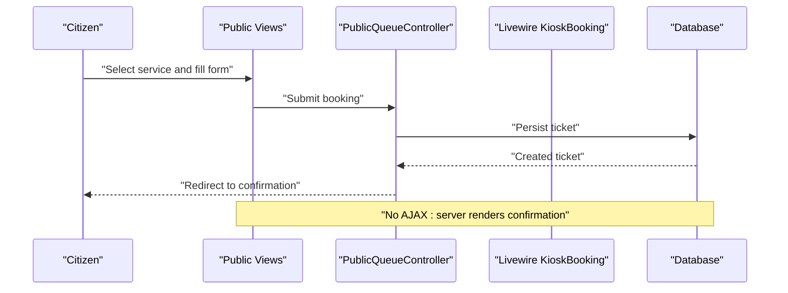
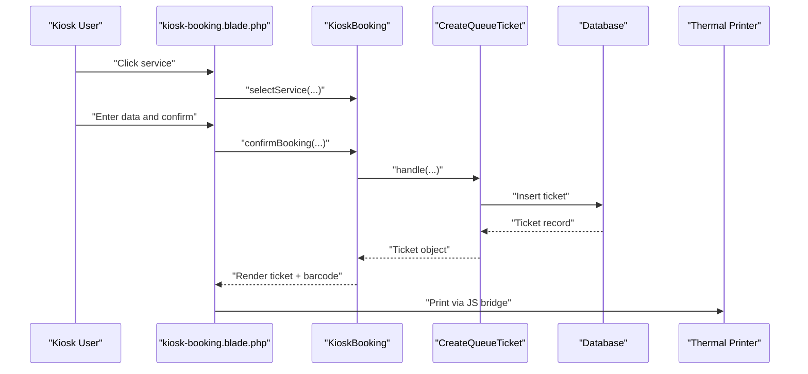
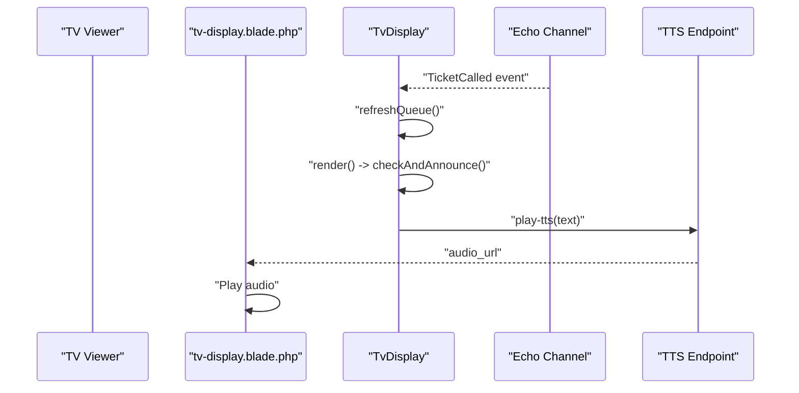
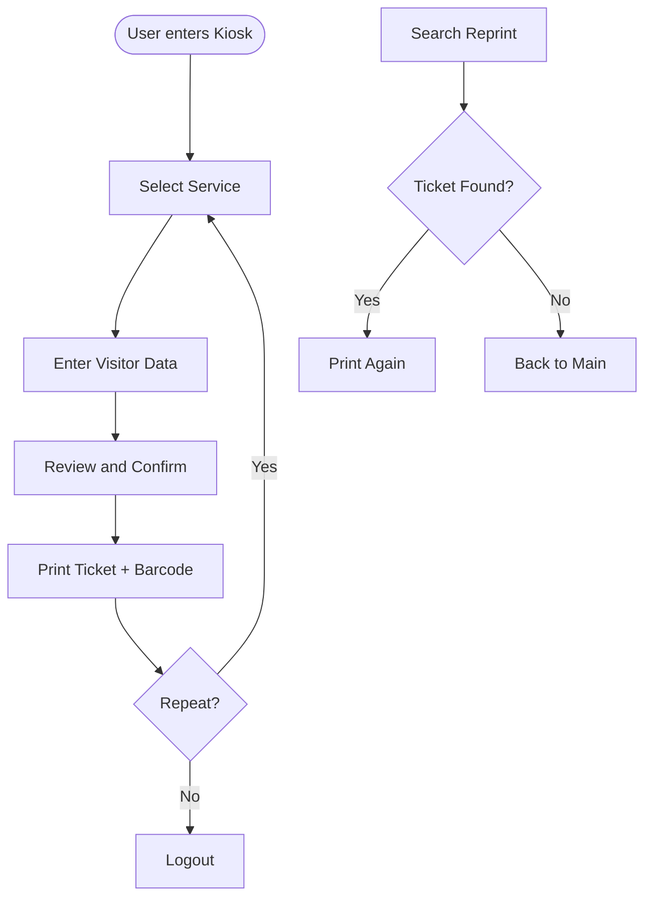
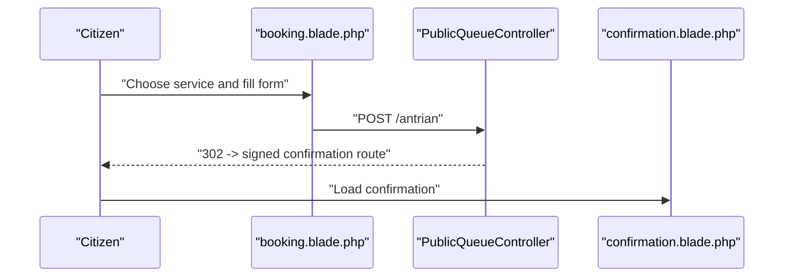
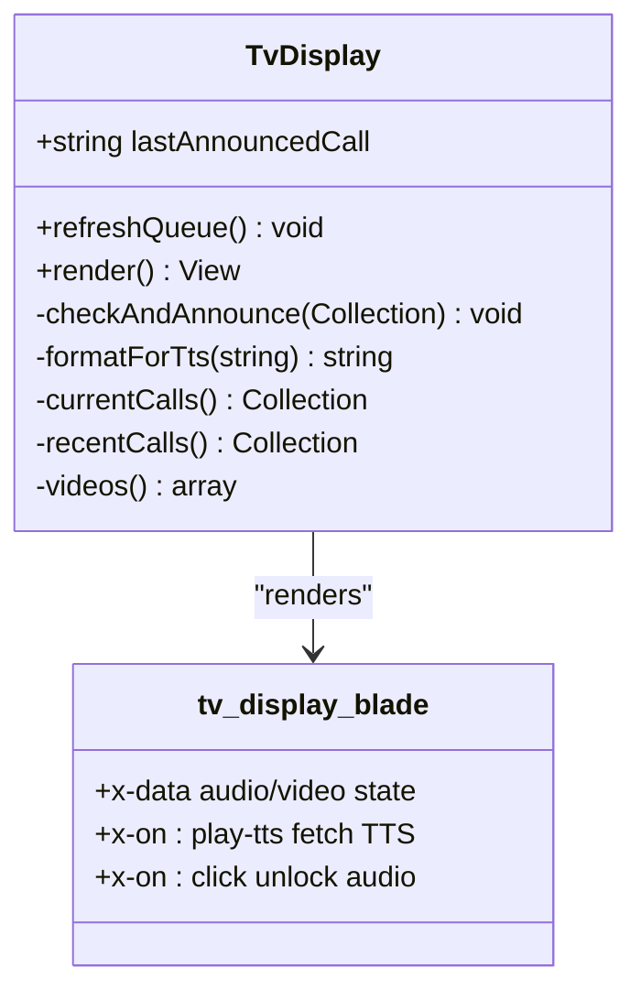
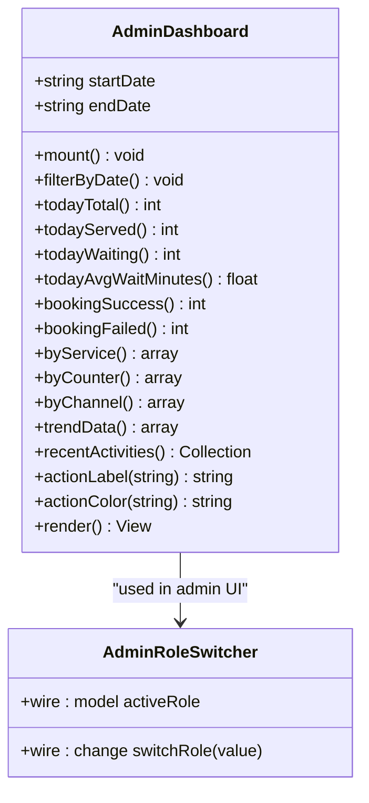
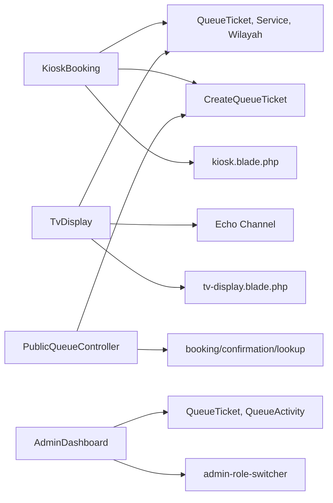

# User Interface Components

<cite>
**Referenced Files in This Document**
- [KioskBooking.php](file://app/Livewire/KioskBooking.php)
- [kiosk-booking.blade.php](file://resources/views/livewire/kiosk-booking.blade.php)
- [TvDisplay.php](file://app/Livewire/TvDisplay.php)
- [tv-display.blade.php](file://resources/views/livewire/tv-display.blade.php)
- [AdminDashboard.php](file://app/Livewire/Dashboard/AdminDashboard.php)
- [admin-role-switcher.blade.php](file://resources/views/livewire/admin-role-switcher.blade.php)
- [PublicQueueController.php](file://app/Http/Controllers/PublicQueueController.php)
- [booking.blade.php](file://resources/views/pages/public/antrian/booking.blade.php)
- [confirmation.blade.php](file://resources/views/pages/public/antrian/confirmation.blade.php)
- [lookup.blade.php](file://resources/views/pages/public/antrian/lookup.blade.php)
- [KioskController.php](file://app/Http/Controllers/KioskController.php)
- [TvDisplayController.php](file://app/Http/Controllers/TvDisplayController.php)
- [kiosk.blade.php](file://resources/views/layouts/kiosk.blade.php)
- [tv-display.blade.php](file://resources/views/layouts/tv-display.blade.php)
</cite>

## Table of Contents
1. [Introduction](#introduction)
2. [Project Structure](#project-structure)
3. [Core Components](#core-components)
4. [Architecture Overview](#architecture-overview)
5. [Detailed Component Analysis](#detailed-component-analysis)
6. [Dependency Analysis](#dependency-analysis)
7. [Performance Considerations](#performance-considerations)
8. [Troubleshooting Guide](#troubleshooting-guide)
9. [Conclusion](#conclusion)
10. [Appendices](#appendices)

## Introduction
This document describes the PTSP user interface components built with Laravel Livewire and Blade. It covers:
- Livewire component architecture and reactive updates without traditional AJAX
- Public web interface for citizens: service selection, booking, and confirmation
- Kiosk interface for self-service booking and authentication
- TV display for real-time queue monitoring and audio announcements
- Administrative dashboard components and role-based variations
- Composition patterns, state management, event handling, and backend integration
- Responsive design, accessibility, and cross-browser compatibility considerations

## Project Structure
The UI is organized around:
- Livewire components under app/Livewire for reactive state and actions
- Blade views under resources/views for rendering and interactivity
- Controllers under app/Http/Controllers for server-side flows and authentication
- Layouts under resources/views/layouts for shared page scaffolding
- Pages under resources/views/pages for feature-specific screens

```mermaid
graph TB
subgraph "Public Web"
PQ["PublicQueueController"]
PubViews["Public Booking Views<br/>booking.blade.php<br/>confirmation.blade.php<br/>lookup.blade.php"]
end
subgraph "Kiosk"
KC["KioskController"]
LB["Livewire KioskBooking"]
KioskViews["Kiosk Views<br/>kiosk-booking.blade.php"]
KioskLayout["kiosk.blade.php"]
end
subgraph "TV Display"
TVC["TvDisplayController"]
TVComp["Livewire TvDisplay"]
TVViews["TV Views<br/>tv-display.blade.php"]
TVLayout["tv-display.blade.php"]
end
subgraph "Admin"
ADC["AdminDashboard"]
RoleSwitch["admin-role-switcher.blade.php"]
end
PQ --> PubViews
KC --> KioskViews
KioskViews --> LB
LB --> KioskLayout
TVC --> TVViews
TVViews --> TVComp
TVComp --> TVLayout
ADC --> RoleSwitch
```

**Diagram sources**
- [PublicQueueController.php:16-110](file://app/Http/Controllers/PublicQueueController.php#L16-L110)
- [booking.blade.php:1-541](file://resources/views/pages/public/antrian/booking.blade.php#L1-L541)
- [confirmation.blade.php:1-146](file://resources/views/pages/public/antrian/confirmation.blade.php#L1-L146)
- [lookup.blade.php:1-169](file://resources/views/pages/public/antrian/lookup.blade.php#L1-L169)
- [KioskController.php:18-144](file://app/Http/Controllers/KioskController.php#L18-L144)
- [kiosk-booking.blade.php:1-588](file://resources/views/livewire/kiosk-booking.blade.php#L1-L588)
- [kiosk.blade.php:1-67](file://resources/views/layouts/kiosk.blade.php#L1-L67)
- [TvDisplayController.php:16-144](file://app/Http/Controllers/TvDisplayController.php#L16-L144)
- [tv-display.blade.php:1-213](file://resources/views/livewire/tv-display.blade.php#L1-L213)
- [tv-display.blade.php:1-31](file://resources/views/layouts/tv-display.blade.php#L1-L31)
- [AdminDashboard.php:12-233](file://app/Livewire/Dashboard/AdminDashboard.php#L12-L233)
- [admin-role-switcher.blade.php:1-8](file://resources/views/livewire/admin-role-switcher.blade.php#L1-L8)

**Section sources**
- [PublicQueueController.php:16-110](file://app/Http/Controllers/PublicQueueController.php#L16-L110)
- [KioskController.php:18-144](file://app/Http/Controllers/KioskController.php#L18-L144)
- [TvDisplayController.php:16-144](file://app/Http/Controllers/TvDisplayController.php#L16-L144)
- [AdminDashboard.php:12-233](file://app/Livewire/Dashboard/AdminDashboard.php#L12-L233)

## Core Components
- KioskBooking Livewire component: multi-step wizard for self-service booking with computed properties, validation, and barcode generation
- TvDisplay Livewire component: real-time queue display with audio announcements and video playback
- AdminDashboard Livewire component: analytics and reporting with computed metrics and filters
- Public booking flow: server-driven forms with client-side wizard logic and confirmation
- Authentication controllers: secure login/logout flows for kiosk and TV display modules

Key reactive patterns:
- Livewire state properties update UI without AJAX
- Computed properties cache and invalidate efficiently
- Event hooks trigger Livewire re-rendering
- Alpine.js manages client-side UX and audio/video playback

**Section sources**
- [KioskBooking.php:25-288](file://app/Livewire/KioskBooking.php#L25-L288)
- [kiosk-booking.blade.php:1-588](file://resources/views/livewire/kiosk-booking.blade.php#L1-L588)
- [TvDisplay.php:18-142](file://app/Livewire/TvDisplay.php#L18-L142)
- [tv-display.blade.php:1-213](file://resources/views/livewire/tv-display.blade.php#L1-L213)
- [AdminDashboard.php:12-233](file://app/Livewire/Dashboard/AdminDashboard.php#L12-L233)

## Architecture Overview
The UI leverages Livewire’s full-stack reactive model:
- Components encapsulate state and behavior
- Blade templates bind component properties and events
- Alpine.js enhances UX with animations, media playback, and keyboard interactions
- Backend actions (CreateQueueTicket, etc.) are invoked via Livewire actions or controller endpoints
- Real-time updates use Livewire re-rendering and Echo events

**Diagram sources**
- [PublicQueueController.php:39-56](file://app/Http/Controllers/PublicQueueController.php#L39-L56)
- [booking.blade.php:220-221](file://resources/views/pages/public/antrian/booking.blade.php#L220-L221)

**Diagram sources**
- [kiosk-booking.blade.php:166-167](file://resources/views/livewire/kiosk-booking.blade.php#L166-L167)
- [kiosk-booking.blade.php:461-470](file://resources/views/livewire/kiosk-booking.blade.php#L461-L470)
- [KioskBooking.php:155-180](file://app/Livewire/KioskBooking.php#L155-L180)

**Diagram sources**
- [TvDisplay.php:22-27](file://app/Livewire/TvDisplay.php#L22-L27)
- [tv-display.blade.php:30-40](file://resources/views/livewire/tv-display.blade.php#L30-L40)

## Detailed Component Analysis

### Kiosk Self-Service Booking
- Multi-step wizard:
  - Step 0: Reprint mode with search by identity or phone
  - Step 1: Service selection with quota indicators
  - Step 2: Visitor data capture with dynamic region options
  - Step 3: Review and confirmation
  - Step 4: Ticket display with barcode and auto-print
- Reactive state:
  - Livewire properties manage step progression and inputs
  - Computed properties cache services and region options
  - Validation runs on submit and on field change
- Thermal printer integration:
  - Alpine event dispatch triggers printing via JS bridge
  - Optional Epson ePOS SDK script included when enabled

**Diagram sources**
- [kiosk-booking.blade.php:16-132](file://resources/views/livewire/kiosk-booking.blade.php#L16-L132)
- [kiosk-booking.blade.php:134-236](file://resources/views/livewire/kiosk-booking.blade.php#L134-L236)
- [kiosk-booking.blade.php:238-359](file://resources/views/livewire/kiosk-booking.blade.php#L238-L359)
- [kiosk-booking.blade.php:361-473](file://resources/views/livewire/kiosk-booking.blade.php#L361-L473)
- [kiosk-booking.blade.php:475-569](file://resources/views/livewire/kiosk-booking.blade.php#L475-L569)

**Section sources**
- [KioskBooking.php:25-288](file://app/Livewire/KioskBooking.php#L25-L288)
- [kiosk-booking.blade.php:1-588](file://resources/views/livewire/kiosk-booking.blade.php#L1-L588)
- [kiosk.blade.php:38-42](file://resources/views/layouts/kiosk.blade.php#L38-L42)

### Public Citizen Booking and Lookup
- Booking flow:
  - Service cards with daily quotas and availability
  - Three-step wizard with Alpine-driven transitions
  - Server-side submission via controller, then redirect to confirmation
- Confirmation:
  - Printable ticket card with position info when applicable
  - Print button optimized for print media queries
- Lookup:
  - Search by ticket number and service date
  - Status-specific guidance and messaging

**Diagram sources**
- [booking.blade.php:220-221](file://resources/views/pages/public/antrian/booking.blade.php#L220-L221)
- [PublicQueueController.php:39-56](file://app/Http/Controllers/PublicQueueController.php#L39-L56)
- [confirmation.blade.php:1-146](file://resources/views/pages/public/antrian/confirmation.blade.php#L1-L146)

**Section sources**
- [booking.blade.php:1-541](file://resources/views/pages/public/antrian/booking.blade.php#L1-L541)
- [confirmation.blade.php:1-146](file://resources/views/pages/public/antrian/confirmation.blade.php#L1-L146)
- [lookup.blade.php:1-169](file://resources/views/pages/public/antrian/lookup.blade.php#L1-L169)
- [PublicQueueController.php:16-110](file://app/Http/Controllers/PublicQueueController.php#L16-L110)

### TV Display Monitoring and Announcements
- Real-time queue display:
  - Current calls hero card and secondary tiles
  - Recent calls history with fade effects
- Audio announcements:
  - On TicketCalled events, Livewire component checks for changes and dispatches play-tts
  - Browser audio unlock overlay and click-to-unlock behavior
- Media playback:
  - Local videos cached and rotated, fallback YouTube playlist
  - Silent audio unlock to satisfy autoplay policies

**Diagram sources**
- [TvDisplay.php:18-142](file://app/Livewire/TvDisplay.php#L18-L142)
- [tv-display.blade.php:1-213](file://resources/views/livewire/tv-display.blade.php#L1-L213)

**Section sources**
- [TvDisplay.php:18-142](file://app/Livewire/TvDisplay.php#L18-L142)
- [tv-display.blade.php:1-213](file://resources/views/livewire/tv-display.blade.php#L1-L213)
- [TvDisplayController.php:16-144](file://app/Http/Controllers/TvDisplayController.php#L16-L144)

### Administrative Dashboard and Role Switching
- AdminDashboard:
  - Computed metrics for totals, served, waiting, average wait minutes
  - Channel breakdown and service/counter trends
  - Recent activity feed
- Role switching:
  - Simple dropdown to switch active roles for testing/administration

**Diagram sources**
- [AdminDashboard.php:12-233](file://app/Livewire/Dashboard/AdminDashboard.php#L12-L233)
- [admin-role-switcher.blade.php:1-8](file://resources/views/livewire/admin-role-switcher.blade.php#L1-L8)

**Section sources**
- [AdminDashboard.php:12-233](file://app/Livewire/Dashboard/AdminDashboard.php#L12-L233)
- [admin-role-switcher.blade.php:1-8](file://resources/views/livewire/admin-role-switcher.blade.php#L1-L8)

## Dependency Analysis
- Livewire components depend on:
  - Eloquent models and enums for data and status
  - Actions (e.g., CreateQueueTicket) for domain operations
  - Config and caching for media and settings
- Blade templates integrate:
  - Alpine.js for animations and media controls
  - Flux UI components for consistent design
  - Echo events for real-time updates
- Controllers mediate between UI and backend, handling authentication and redirects

**Diagram sources**
- [KioskBooking.php:5-21](file://app/Livewire/KioskBooking.php#L5-L21)
- [TvDisplay.php:5-14](file://app/Livewire/TvDisplay.php#L5-L14)
- [PublicQueueController.php:5-14](file://app/Http/Controllers/PublicQueueController.php#L5-L14)
- [AdminDashboard.php:5-10](file://app/Livewire/Dashboard/AdminDashboard.php#L5-L10)

**Section sources**
- [KioskBooking.php:5-21](file://app/Livewire/KioskBooking.php#L5-L21)
- [TvDisplay.php:5-14](file://app/Livewire/TvDisplay.php#L5-L14)
- [PublicQueueController.php:5-14](file://app/Http/Controllers/PublicQueueController.php#L5-L14)
- [AdminDashboard.php:5-10](file://app/Livewire/Dashboard/AdminDashboard.php#L5-L10)

## Performance Considerations
- Livewire computed properties with persistence reduce redundant queries
- Alpine-driven transitions avoid heavy DOM manipulations
- TV display caches video list and uses lazy loading
- Thermal printer printing is deferred until after render to ensure DOM readiness
- Use of CDN fonts and preconnect improves perceived performance

[No sources needed since this section provides general guidance]

## Troubleshooting Guide
Common issues and remedies:
- Kiosk reprint not found:
  - Verify identity/phone matches and date is today
  - Ensure service is in booked/waiting/called statuses
- TV audio blocked:
  - Click overlay to unlock audio context
  - Ensure browser allows autoplay and site is unmuted
- TV videos not playing:
  - Confirm MP4/WebM/Ogg files exist in storage/videos
  - Check network connectivity and CORS settings
- Admin metrics stale:
  - Adjust date range filters to refresh computed values
  - Clear browser cache if using persistent computed values

**Section sources**
- [KioskBooking.php:238-262](file://app/Livewire/KioskBooking.php#L238-L262)
- [tv-display.blade.php:42-51](file://resources/views/livewire/tv-display.blade.php#L42-L51)
- [TvDisplayController.php:108-122](file://app/Http/Controllers/TvDisplayController.php#L108-L122)
- [AdminDashboard.php:24-38](file://app/Livewire/Dashboard/AdminDashboard.php#L24-L38)

## Conclusion
The PTSP UI combines Livewire’s reactive simplicity with Blade templating and Alpine.js enhancements to deliver responsive, accessible, and real-time experiences across public booking, kiosk self-service, TV monitoring, and administration. State is managed declaratively, events drive updates, and backend actions remain cohesive with frontend components.

[No sources needed since this section summarizes without analyzing specific files]

## Appendices

### Accessibility and Cross-Browser Notes
- Keyboard navigation supported in interactive cards and buttons
- Focus styles and ARIA landmarks present in layouts
- Font loading via preconnect for improved accessibility
- Safari and Chrome autoplay policies handled with silent audio unlock

**Section sources**
- [kiosk.blade.php:13-14](file://resources/views/layouts/kiosk.blade.php#L13-L14)
- [tv-display.blade.php:13-14](file://resources/views/layouts/tv-display.blade.php#L13-L14)
- [tv-display.blade.php:8-14](file://resources/views/livewire/tv-display.blade.php#L8-L14)